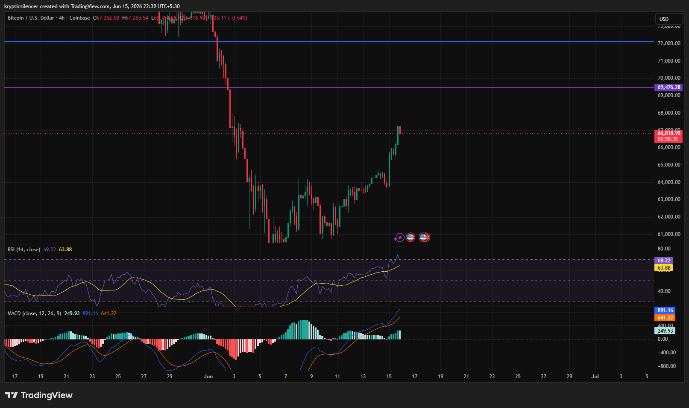

# Bitcoin — 4H V-Shaped Recovery Into Major Resistance

**Date:** 2026-06-15
**Time:** ~22:39 IST
**Instrument:** BTCUSD
**Timeframe:** 4H
**Venue:** Coinbase
**Charting Platform:** TradingView

---

## Context

Bitcoin experienced a sharp capitulation event earlier in the month, losing multiple support levels and accelerating into a major demand region near 60k.

Following the selloff, buyers aggressively stepped in and generated a strong V-shaped recovery. Price has now reclaimed a substantial portion of the decline and is approaching a significant higher-timeframe resistance zone.

---

## Observation

### 1️⃣ Strong Recovery Structure

* Bitcoin has formed a clear sequence of higher highs and higher lows since the capitulation low.
* Recovery momentum has remained consistent with limited pullbacks.
* Recent candles show sustained bullish participation.

The short-term structure remains firmly bullish.

### 2️⃣ Resistance Reclaim Attempt

* Price has rallied back into the 67k–69k resistance region.
* This area previously acted as a major breakdown zone during the selloff.
* Current price action is testing whether former support can be reclaimed.

This is the most important technical area on the chart.

### 3️⃣ RSI Strength

* RSI has advanced into the upper-60 region.
* Momentum remains elevated without reaching extreme overbought conditions.
* Higher RSI readings continue to support the recovery thesis.

Momentum remains firmly in favor of buyers.

### 4️⃣ MACD Confirmation

* MACD remains above the signal line.
* Positive histogram readings continue to print.
* Momentum expansion remains intact despite minor fluctuations.

The recovery is supported by both trend and momentum indicators.

### 5️⃣ Market Structure Shift

* The previous bearish impulse has transitioned into a constructive recovery trend.
* Price has successfully defended higher lows throughout the advance.
* Buyers continue absorbing supply during pullbacks.

Current market behavior favors continuation rather than immediate reversal.

---

## Hypothesis

Bitcoin is attempting to reclaim a major resistance region after completing a strong recovery from demand.

Two conditional paths remain active:

### Scenario A — Bullish Breakout

Acceptance above the 67k–69k resistance area would confirm a significant structural recovery and could open the path toward higher liquidity and previously broken support zones.

### Scenario B — Resistance Rejection

Failure to reclaim resistance may trigger profit-taking and a corrective pullback toward recent support levels before another breakout attempt.

At present, momentum favors buyers, but the market is approaching a critical decision point.

---

## Invalidation / Confirmation

* Sustained acceptance above resistance → bullish continuation confirmed.
* Higher low formation after any pullback → recovery structure remains intact.
* Strong rejection followed by loss of recent swing support → bullish thesis weakens.

---

## Notes

This setup highlights a powerful V-shaped recovery following a capitulation event. The combination of rising RSI, bullish MACD structure, and a sequence of higher highs and higher lows suggests improving market conditions. However, Bitcoin is now testing a key resistance zone that may determine whether the recovery evolves into a larger trend reversal or pauses for consolidation.

Text formatting and clarity were assisted by AI; the market analysis and structural interpretation are independently conducted by the author.
This material is intended for educational and research documentation purposes only and does not constitute financial advice.
