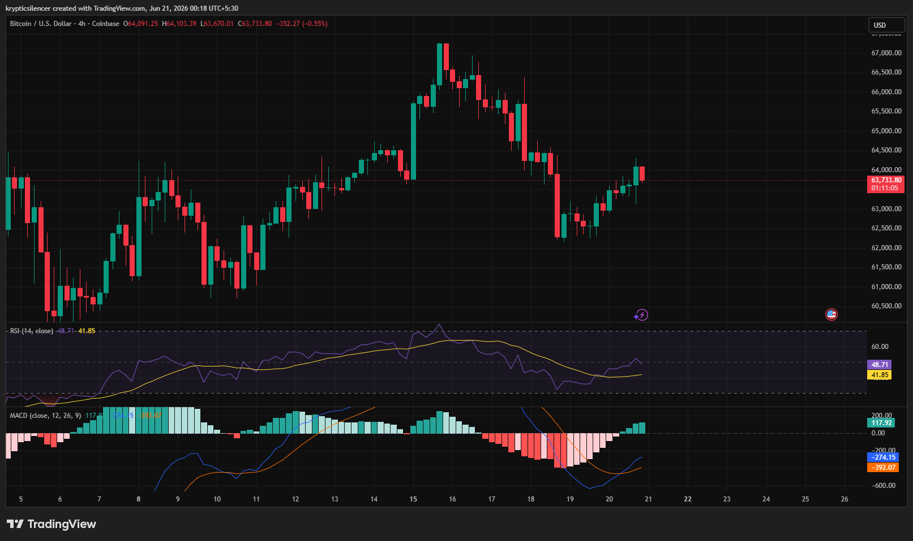

# Bitcoin — 4H Recovery Attempt After Sharp Selloff

**Date:** 2026-06-21
**Time:** ~00:18 IST
**Instrument:** BTCUSD
**Timeframe:** 4H
**Venue:** Coinbase
**Charting Platform:** TradingView

---

## Context

Bitcoin experienced a sharp correction from the 67k region after failing to sustain bullish momentum near local highs. The decline accelerated into the 62k area before buyers stepped in and generated a recovery attempt.

Price has since rebounded from the selloff low, but remains below the recent swing high, leaving the market in a transitional phase between recovery and trend continuation.

---

## Observation

### 1️⃣ Failed High & Pullback

* BTC formed a local peak near 67k before sellers regained control.
* The subsequent decline erased several days of bullish progress.
* Price quickly rotated into lower support levels.

The rejection signaled weakening bullish momentum.

### 2️⃣ Strong Reaction From Support

* Buyers defended the 62k region aggressively.
* Multiple bullish candles emerged following the selloff.
* Price recovered a significant portion of the decline.

Demand remains active at lower levels.

### 3️⃣ Recovery Structure

* Recent price action shows higher lows forming after the liquidation event.
* The market is attempting to rebuild bullish structure.
* However, price has not yet reclaimed the previous swing high.

Recovery is underway but remains unconfirmed.

### 4️⃣ RSI Improvement

* RSI rebounded from lower levels and moved back toward the mid-range.
* Momentum has improved compared to the recent selloff.
* Readings remain below strong bullish territory.

Momentum recovery is visible but not dominant.

### 5️⃣ MACD Bullish Reversal Attempt

* MACD histogram has transitioned from deep negative readings toward positive territory.
* The MACD line is attempting a bullish crossover.
* Selling pressure appears to be fading.

Momentum indicators favor stabilization rather than continued liquidation.

---

## Hypothesis

Bitcoin is attempting to establish a recovery structure following a sharp correction from local highs.

Two conditional paths remain active:

### Scenario A — Bullish Recovery

Continuation above recent highs would confirm buyer control and open the path toward a retest of the 66k–67k resistance region.

### Scenario B — Range Consolidation / Rejection

Failure to reclaim resistance could result in a broader consolidation phase or another test of lower support levels before trend continuation.

Current conditions favor recovery, but confirmation is still required.

---

## Invalidation / Confirmation

* Break above recent recovery highs → bullish continuation confirmed.
* Higher low formation on pullbacks → recovery structure remains intact.
* Breakdown below recent support → recovery thesis weakens.

---

## Notes

This setup highlights a market recovering from a sharp correction. Buyers successfully defended support and generated a meaningful rebound, while RSI and MACD both show improving momentum conditions. The next key test is whether Bitcoin can reclaim the recent swing highs and transition from recovery into a renewed bullish trend.

Text formatting and clarity were assisted by AI; the market analysis and structural interpretation are independently conducted by the author.
This material is intended for educational and research documentation purposes only and does not constitute financial advice.
