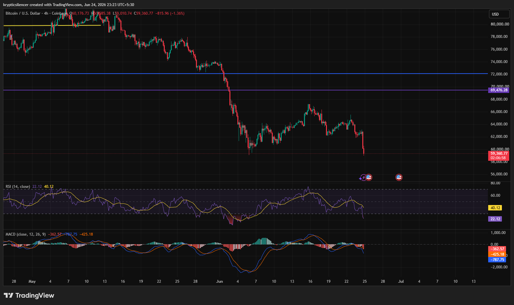

# BTC/USD — 4H Breakdown Pushes Price Back Toward Major Support

**Date:** 2026-06-24
**Time:** ~23:23 IST
**Instrument:** BTCUSD
**Timeframe:** 4H
**Venue:** Coinbase
**Charting Platform:** TradingView

---

## Context

Bitcoin has remained under sustained selling pressure throughout June after failing to reclaim higher-timeframe resistance levels. Multiple recovery attempts have been rejected, reinforcing a broader bearish structure characterized by lower highs and lower lows.

The latest move has driven price back toward the psychologically important $60,000 region following another sharp downside impulse.

---

## Observation

### 1️⃣ Breakdown Below Recent Consolidation

* BTC spent several sessions consolidating between approximately $62k and $65k.
* Buyers repeatedly attempted to stabilize price within this range.
* The latest candle broke below consolidation support and accelerated downward.

This breakdown signals renewed seller dominance.

### 2️⃣ Major Support Zone Under Pressure

* Price has returned to the $59k–60k region.
* This area previously acted as a reaction zone during earlier declines.
* Market participants are closely watching whether buyers can defend support.

A failure here could trigger another wave of downside expansion.

### 3️⃣ RSI Enters Oversold Territory

* RSI has fallen into deeply oversold conditions.
* Current readings reflect strong bearish momentum.
* Although oversold conditions may support short-term relief rallies, no confirmed reversal signal has emerged.

Momentum remains heavily tilted toward sellers.

### 4️⃣ MACD Maintains Bearish Structure

* MACD remains below the signal line.
* Histogram readings continue to print negative values.
* Downside momentum has accelerated alongside the latest breakdown.

Momentum indicators remain aligned with the prevailing bearish trend.

### 5️⃣ Lower High Sequence Remains Intact

* Previous recovery attempts failed beneath major resistance levels.
* Price continues to establish lower highs throughout the broader decline.
* No higher-high structure has been formed to challenge the prevailing trend.

The broader market structure continues to favor bearish continuation.

---

## Hypothesis

Bitcoin remains vulnerable after breaking below recent consolidation support and returning to a key psychological level.

Two conditional paths remain active:

### Scenario A — Oversold Relief Bounce

A successful defense of the $59k–60k region combined with improving momentum could trigger a short-term recovery toward recent resistance levels.

### Scenario B — Bearish Continuation

Failure to hold current support would reinforce the broader downtrend and potentially open the path toward deeper downside targets.

Current structure remains bearish until buyers reclaim broken support and establish a stronger recovery pattern.

---

## Invalidation / Confirmation

* Break above recent swing highs → bearish structure weakens.
* RSI recovery accompanied by bullish momentum expansion → relief rally gains credibility.
* Sustained trading below the current support region → bearish continuation confirmed.

---

## Notes

This setup highlights a market that remains under significant selling pressure despite several recovery attempts throughout the month. The recent breakdown from consolidation, oversold RSI readings, negative MACD structure, and persistent lower-high formation collectively favor sellers. The $59k–60k region now represents the key area to monitor for either stabilization or further downside expansion.

Text formatting and clarity were assisted by AI; the market analysis and structural interpretation are independently conducted by the author. This material is intended for educational and research documentation purposes only and does not constitute financial advice.
