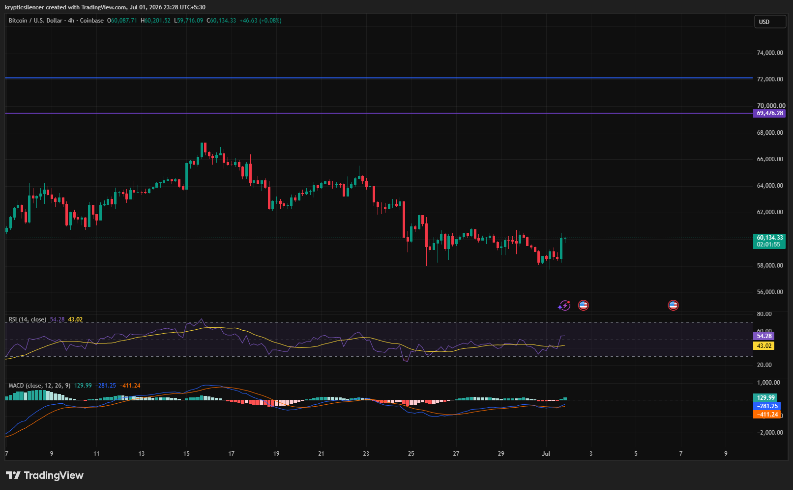

# BTC — 4H Consolidation Shows Early Signs of Momentum Recovery

**Date:** 2026-07-01  
**Time:** ~23:28 IST  
**Instrument:** BTCUSD  
**Timeframe:** 4H  
**Venue:** Coinbase  
**Charting Platform:** TradingView  

---

## Context

Bitcoin has spent the past week consolidating after a sharp decline from higher price levels. Price has remained range-bound around the 60,000 region as buyers attempt to stabilize the market while sellers continue defending overhead resistance.

The latest session shows a modest bullish reaction from the lower portion of the consolidation range.

---

## Observation

### 1️⃣ Sideways Consolidation Persists

* Price continues trading within a relatively narrow range.
* Neither buyers nor sellers have established a decisive breakout.
* The market remains in a short-term equilibrium following June's selloff.

Consolidation remains the dominant structure.

### 2️⃣ Buyers Defend Local Support

* Recent candles bounced from the lower end of the trading range.
* Higher intraday lows suggest buyers are becoming more active.
* Immediate downside pressure has eased.

Support continues to attract buying interest.

### 3️⃣ RSI Turns Higher

* RSI has recovered into the mid-50 region.
* Momentum has improved after previously hovering near neutral.
* Buyers are beginning to regain short-term strength.

Momentum is gradually shifting toward the bulls.

### 4️⃣ MACD Begins Recovering

* MACD histogram has turned positive.
* The MACD line is attempting to strengthen after a prolonged weak phase.
* Bullish momentum is improving but remains relatively modest.

Momentum favors a recovery, though confirmation is still required.

### 5️⃣ Major Resistance Remains Overhead

* Price remains well below the major resistance levels highlighted above.
* The broader trend has yet to transition into a bullish structure.
* Any sustained recovery will require reclaiming higher resistance zones.

The larger market structure remains cautious despite improving short-term momentum.

---

## Hypothesis

Bitcoin continues consolidating after its previous decline while momentum indicators begin showing early signs of recovery.

Two conditional paths remain active:

### Scenario A — Bullish Breakout

A successful break above the consolidation range, supported by strengthening RSI and MACD, could initiate a broader recovery toward higher resistance.

### Scenario B — Continued Range or Breakdown

Failure to overcome resistance may extend the current sideways consolidation or trigger another retest of recent lows.

The market remains neutral until price exits the current range.

---

## Invalidation / Confirmation

* Break above the recent consolidation highs → bullish continuation strengthens.
* RSI holding above neutral with expanding MACD momentum → buyers gain control.
* Breakdown below recent support → bearish pressure resumes.

---

## Notes

Bitcoin remains in a consolidation phase following June's decline. While RSI and MACD are beginning to improve, price has yet to confirm a breakout from its current trading range. The next directional move will likely depend on whether buyers can overcome nearby resistance or sellers regain control at current levels.

Text formatting and clarity were assisted by AI; the market analysis and structural interpretation are independently conducted by the author. This material is intended for educational and research documentation purposes only and does not constitute financial advice.
