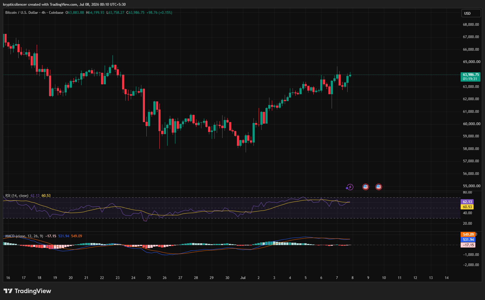

# Bitcoin — 4H Recovery Rally Tests Key Resistance

**Date:** 2026-07-08  
**Time:** ~00:10 IST  
**Instrument:** BTCUSD  
**Timeframe:** 4H  
**Venue:** Coinbase  
**Charting Platform:** TradingView  

---

## Context

Bitcoin has staged a notable recovery after establishing a local bottom near the start of July. The recent advance has lifted price back toward the 64,000 region, recovering a significant portion of the prior decline while maintaining a sequence of higher highs and higher lows.

The market is now approaching an area where sellers previously became active, making the current reaction important for determining whether the recovery can continue.

---

## Observation

### 1️⃣ Higher Highs Continue

* Price has formed consecutive higher highs and higher lows.
* Pullbacks remain relatively shallow.
* Buyers continue to defend dips throughout the recovery.

Short-term structure remains constructive.

### 2️⃣ Price Near Resistance

* BTC is testing the upper boundary of its recent recovery.
* Previous selling pressure emerged around the current region.
* A breakout would strengthen the bullish recovery narrative.

Resistance is now the key level to monitor.

### 3️⃣ RSI Shows Strong Momentum

* RSI has recovered into the low-60 region.
* Momentum favors buyers without entering overbought territory.
* The indicator still leaves room for additional upside.

Momentum remains healthy.

### 4️⃣ MACD Remains Bullish

* MACD stays above the signal line.
* Histogram remains positive despite slight moderation.
* Bullish momentum continues, although expansion has slowed.

Trend momentum still favors buyers.

### 5️⃣ Recovery Faces Its First Major Test

* Price has recovered steadily from recent lows.
* Current resistance may determine whether the rally accelerates or pauses.
* A decisive breakout would confirm continued strength.

The market is approaching an important decision point.

---

## Hypothesis

Bitcoin remains in a short-term recovery trend supported by constructive price structure and positive momentum indicators.

Two conditional paths remain active:

### Scenario A — Bullish Continuation

A sustained move above current resistance could extend the recovery toward higher resistance zones.

### Scenario B — Consolidation

Failure to break resistance may produce a healthy pullback before another attempt higher, provided higher lows remain intact.

The short-term outlook remains constructive while buyers defend recent swing lows.

---

## Invalidation / Confirmation

* Break above recent highs → bullish continuation strengthens.
* RSI remains above 50 with positive MACD → momentum stays supportive.
* Loss of recent higher lows → recovery structure weakens.

---

## Notes

Bitcoin continues recovering with higher highs, improving momentum, and a bullish MACD structure. While price is approaching an important resistance area, buyers currently retain short-term control. The reaction around this zone will likely determine whether the recovery extends or enters consolidation.

Text formatting and clarity were assisted by AI; the market analysis and structural interpretation are independently conducted by the author. This material is intended for educational and research documentation purposes only and does not constitute financial advice.
