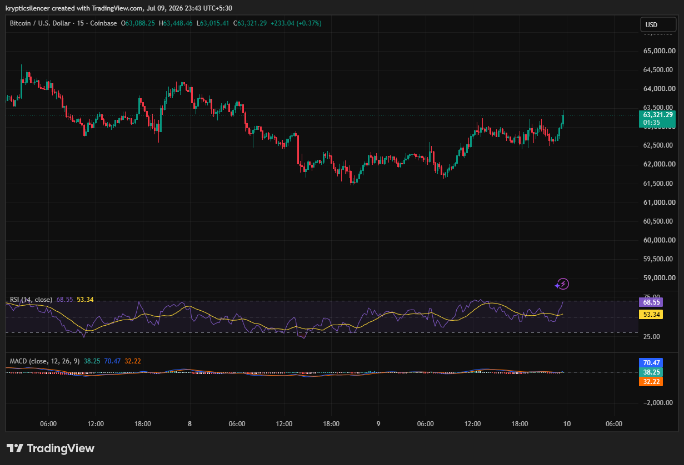

# Bitcoin — 15M Intraday Breakout Attempts to Regain Momentum

**Date:** 2026-07-09  
**Time:** ~23:43 IST  
**Instrument:** BTCUSD  
**Timeframe:** 15M  
**Venue:** Coinbase  
**Charting Platform:** TradingView  

---

## Context

Bitcoin spent much of the session trading within a broad intraday range after recovering from earlier weakness. Following several hours of consolidation, buyers regained control and pushed price toward the upper boundary of the range.

The market is now attempting to establish short-term bullish momentum through a breakout.

---

## Observation

### 1️⃣ Intraday Higher Lows

* Price has transitioned from a declining structure into higher lows.
* Buyers consistently defended pullbacks during the latter half of the session.
* The recovery suggests improving short-term sentiment.

Intraday structure has turned constructive.

### 2️⃣ Breakout Toward Range High

* BTC has rallied back toward recent session highs.
* Price is testing the upper edge of the consolidation range.
* A sustained move above resistance would strengthen bullish momentum.

Resistance remains the immediate hurdle.

### 3️⃣ RSI Strengthens

* RSI has climbed into the upper-60 region.
* Momentum has accelerated alongside the latest breakout attempt.
* While approaching overbought territory, momentum still favors buyers.

Short-term momentum remains positive.

### 4️⃣ MACD Maintains Bullish Bias

* MACD remains above the signal line.
* Histogram continues printing positive values.
* Bullish momentum remains intact despite limited expansion.

Momentum indicators continue supporting the recovery.

### 5️⃣ Buyers Regain Control

* The latest advance has erased much of the earlier session weakness.
* Price action now favors buyers as long as higher lows are maintained.
* Follow-through above resistance would confirm the breakout.

The next move depends on whether buyers can sustain momentum.

---

## Hypothesis

Bitcoin has shifted back into a constructive intraday structure after recovering from consolidation.

Two conditional paths remain active:

### Scenario A — Bullish Continuation

A successful breakout above the recent range high could trigger further upside and extend the intraday rally.

### Scenario B — Range Rejection

Failure to sustain the breakout may result in another rotation back into the established consolidation range before buyers attempt another move.

Current momentum slightly favors the bulls.

---

## Invalidation / Confirmation

* Break above recent session high → bullish continuation strengthens.
* RSI remains above 50 with positive MACD → momentum stays supportive.
* Loss of recent higher lows → breakout weakens and range trading resumes.

---

## Notes

Bitcoin is attempting an intraday breakout after building a series of higher lows throughout the session. RSI and MACD both support the recent recovery, although confirmation will require price to hold above current resistance. Until then, the move should be viewed as an active breakout attempt rather than a confirmed trend expansion.

Text formatting and clarity were assisted by AI; the market analysis and structural interpretation are independently conducted by the author. This material is intended for educational and research documentation purposes only and does not constitute financial advice.
