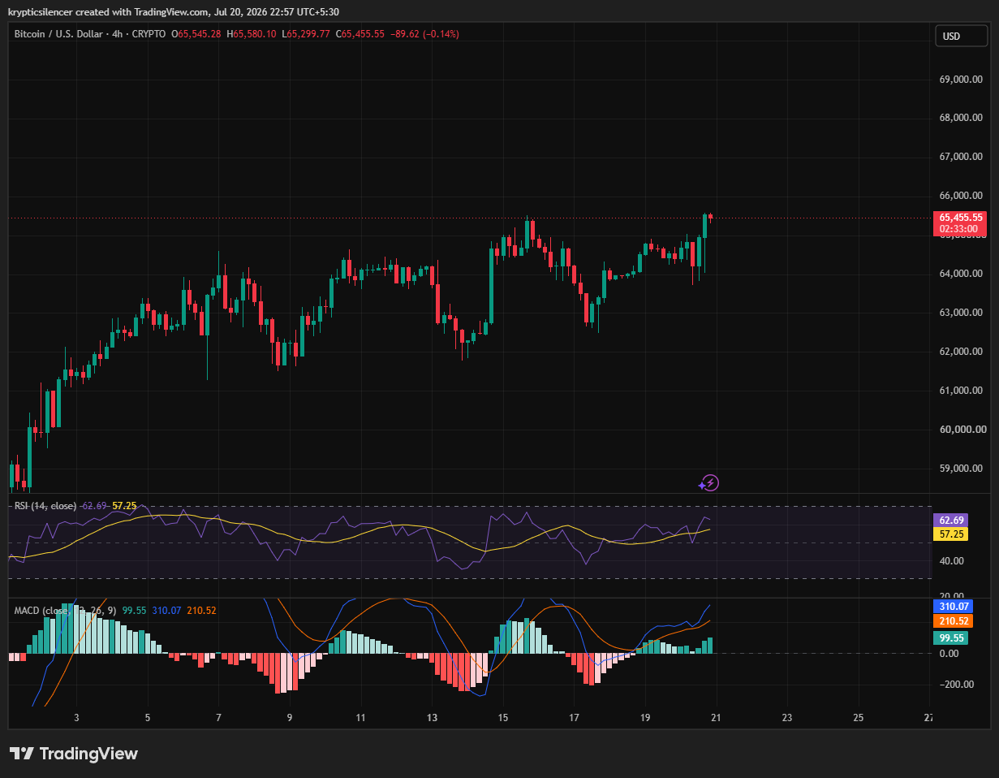

# Bitcoin — 4H Recovery Tests Resistance as Bullish Momentum Strengthens

**Date:** 2026-07-20  
**Time:** ~22:57 IST  
**Instrument:** BTCUSD  
**Timeframe:** 4H  
**Venue:** CRYPTO  
**Charting Platform:** TradingView  

---

## Context

Bitcoin has continued its recovery over the past several weeks, producing a sequence of higher lows and higher highs. Following a brief pullback, buyers regained control and pushed price back toward the recent swing highs near the 65.5k region.

Price is now testing resistance after a steady bullish advance.

---

## Observation

### 1️⃣ Higher High Structure Continues

* Bitcoin maintains a clear sequence of higher highs and higher lows.
* Recent pullbacks have been shallow and quickly absorbed by buyers.
* The latest rally has returned price to local resistance.

The prevailing structure continues to favor the bulls.

### 2️⃣ Resistance Under Pressure

* Price is testing the upper boundary of the recent trading range.
* Buyers have repeatedly challenged this level.
* A decisive breakout has yet to be confirmed.

Current resistance remains the key technical level.

### 3️⃣ RSI Supports Bullish Momentum

* RSI has climbed above the midline into bullish territory.
* Momentum has strengthened without reaching extreme overbought conditions.
* Buyers continue to maintain momentum.

RSI favors continued upside while remaining sustainable.

### 4️⃣ MACD Remains Positive

* MACD remains above the signal line.
* The histogram continues printing positive values.
* Bullish momentum remains intact despite slowing slightly near resistance.

Momentum indicators continue to support buyers.

### 5️⃣ Breakout Decision Approaches

* Price is compressing beneath resistance.
* Sustained buying pressure could trigger a breakout.
* Failure to clear resistance may result in another short-term pullback.

The next move will likely determine near-term direction.

---

## Hypothesis

Bitcoin remains technically bullish while holding its higher-low structure.

Two conditional paths remain active:

### Scenario A — Bullish Breakout

A decisive close above resistance supported by expanding momentum could initiate another leg higher.

### Scenario B — Consolidation

Failure to break resistance may lead to another healthy pullback before buyers attempt another advance.

The broader trend remains constructive while higher lows continue to hold.

---

## Invalidation / Confirmation

* Break above recent swing high → bullish continuation confirmed.
* RSI holding above 50 alongside positive MACD momentum → buyers remain in control.
* Breakdown below the latest higher low → short-term bullish structure weakens.

---

## Notes

Bitcoin continues to trade within a healthy uptrend, with momentum indicators favoring buyers as price tests resistance. Whether bulls can convert this resistance into support will likely determine the next major directional move.

Text formatting and clarity were assisted by AI; the market analysis and structural interpretation are independently conducted by the author. This material is intended for educational and research documentation purposes only and does not constitute financial advice.
