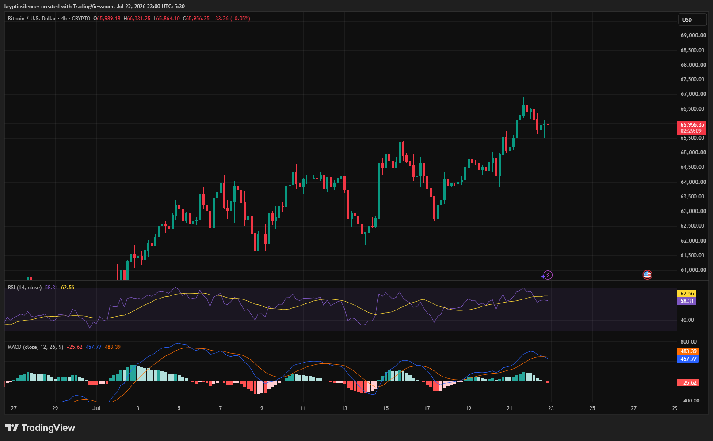

# Bitcoin — 4H Pullback Tests Bullish Structure After Fresh Breakout

**Date:** 2026-07-22  
**Time:** ~23:00 IST  
**Instrument:** BTCUSD  
**Timeframe:** 4H  
**Venue:** CRYPTO  
**Charting Platform:** TradingView  

---

## Context

Bitcoin extended its recent uptrend with a breakout toward the 66.8k region before encountering profit-taking. Following the rally, price has pulled back modestly while remaining above previous support, suggesting the broader bullish structure is still intact.

The market is currently consolidating after the latest impulsive move.

---

## Observation

### 1️⃣ Bullish Market Structure Remains Intact

* Bitcoin continues to print higher highs and higher lows.
* The recent decline has been relatively shallow compared to the preceding rally.
* Price remains above recent breakout levels.

The overall trend continues to favor buyers.

### 2️⃣ Pullback Into Potential Support

* Selling pressure has emerged after the recent breakout.
* Current price action is testing an area that may act as new support.
* Buyers are attempting to stabilize the market following the retracement.

Support is now the key level to monitor.

### 3️⃣ RSI Cools From Strong Levels

* RSI has eased from recent highs while remaining above the midpoint.
* Momentum has moderated without becoming bearish.
* The reset could provide room for another upside attempt.

Momentum remains constructive despite the pullback.

### 4️⃣ MACD Shows Slowing Bullish Momentum

* MACD remains above the zero line.
* Histogram has weakened, reflecting slowing upside momentum.
* No confirmed bearish crossover is visible yet.

The bullish trend has slowed but has not been invalidated.

### 5️⃣ Consolidation May Precede Next Move

* Price is compressing after a strong advance.
* Buyers and sellers are currently battling near recent highs.
* A breakout or deeper pullback will likely determine the next trend.

The market is approaching another decision point.

---

## Hypothesis

Bitcoin remains in a healthy bullish trend despite short-term consolidation.

Two conditional paths remain active:

### Scenario A — Bullish Continuation

If support holds and buyers reclaim recent highs, BTC could resume its uptrend and establish fresh highs.

### Scenario B — Deeper Correction

Failure to hold the current support zone would increase the probability of a larger retracement before the broader uptrend resumes.

The higher-low structure continues to favor buyers until proven otherwise.

---

## Invalidation / Confirmation

* Break above the recent swing high → bullish continuation confirmed.
* RSI remaining above 50 alongside sustained positive MACD → buyers maintain control.
* Breakdown below the latest higher low → probability of a deeper correction increases.

---

## Notes

Bitcoin is consolidating after another impulsive rally, with momentum indicators cooling but remaining broadly constructive. As long as higher lows continue to hold, the larger bullish trend remains intact, making the current pullback an important area to monitor.

Text formatting and clarity were assisted by AI; the market analysis and structural interpretation are independently conducted by the author. This material is intended for educational and research documentation purposes only and does not constitute financial advice.
