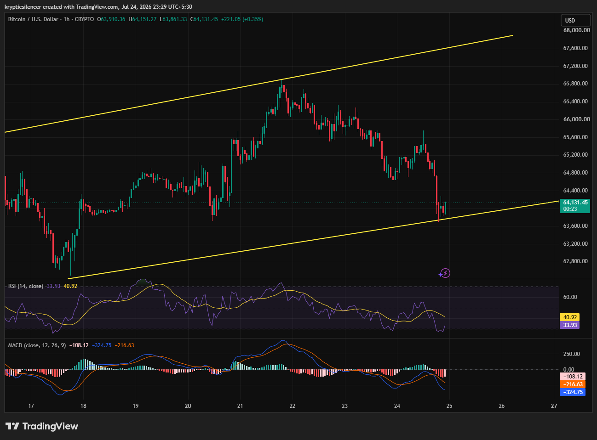

# Bitcoin — 1H Tests Rising Channel Support as Sellers Lose Momentum

**Date:** 2026-07-24  
**Time:** ~23:29 IST  
**Instrument:** BTCUSD  
**Timeframe:** 1H  
**Venue:** CRYPTO  
**Charting Platform:** TradingView  

---

## Context

Bitcoin has been trading inside a rising channel over recent sessions, respecting both the upper and lower trendlines. After failing to sustain its latest push higher, price declined toward the lower boundary of the channel, where buyers have begun to respond.

The market is now testing whether channel support can once again trigger a recovery.

---

## Observation

### 1️⃣ Rising Channel Remains Intact

* Price continues to respect the ascending channel structure.
* The latest decline reached the lower trendline without breaking it.
* Buyers have reacted immediately after the support test.

The broader short-term structure remains constructive.

### 2️⃣ Support Generates Initial Bounce

* Price rebounded shortly after touching channel support.
* Selling pressure has eased near the lower boundary.
* Follow-through buying is still required for confirmation.

Support is currently acting as the key technical level.

### 3️⃣ RSI Near Oversold Recovery

* RSI briefly approached oversold territory before rebounding.
* Momentum remains weak but is beginning to improve.
* Buyers have not yet established strong bullish momentum.

The indicator suggests early signs of stabilization.

### 4️⃣ MACD Remains Bearish

* MACD stays below the signal line.
* Histogram remains negative, although downside momentum is beginning to fade.
* A bullish crossover has not yet occurred.

Momentum continues to favor caution despite the bounce.

### 5️⃣ Channel Direction Faces Test

* Holding the lower trendline would preserve the current ascending structure.
* A break below support would invalidate the channel.
* The next reaction will likely determine short-term direction.

The lower boundary remains the critical area to monitor.

---

## Hypothesis

Bitcoin remains inside an ascending channel despite the recent pullback.

Two conditional paths remain active:

### Scenario A — Bullish Recovery

If channel support continues to hold and momentum improves, BTC could rebound toward the upper boundary of the channel.

### Scenario B — Bearish Breakdown

Failure to defend the lower trendline would invalidate the channel and increase the probability of a deeper correction.

The bullish structure remains valid while channel support is preserved.

---

## Invalidation / Confirmation

* Strong rebound from channel support with improving RSI and a bullish MACD crossover → bullish continuation gains credibility.
* Break below the lower channel boundary → bearish breakdown confirmed.
* Reclaiming recent swing highs → strengthens the bullish outlook.

---

## Notes

Bitcoin is testing a key technical support inside its ascending channel. While RSI is attempting to recover from weaker levels, MACD remains bearish, suggesting buyers still need stronger confirmation before a sustained recovery can develop.

Text formatting and clarity were assisted by AI; the market analysis and structural interpretation are independently conducted by the author. This material is intended for educational and research documentation purposes only and does not constitute financial advice.
