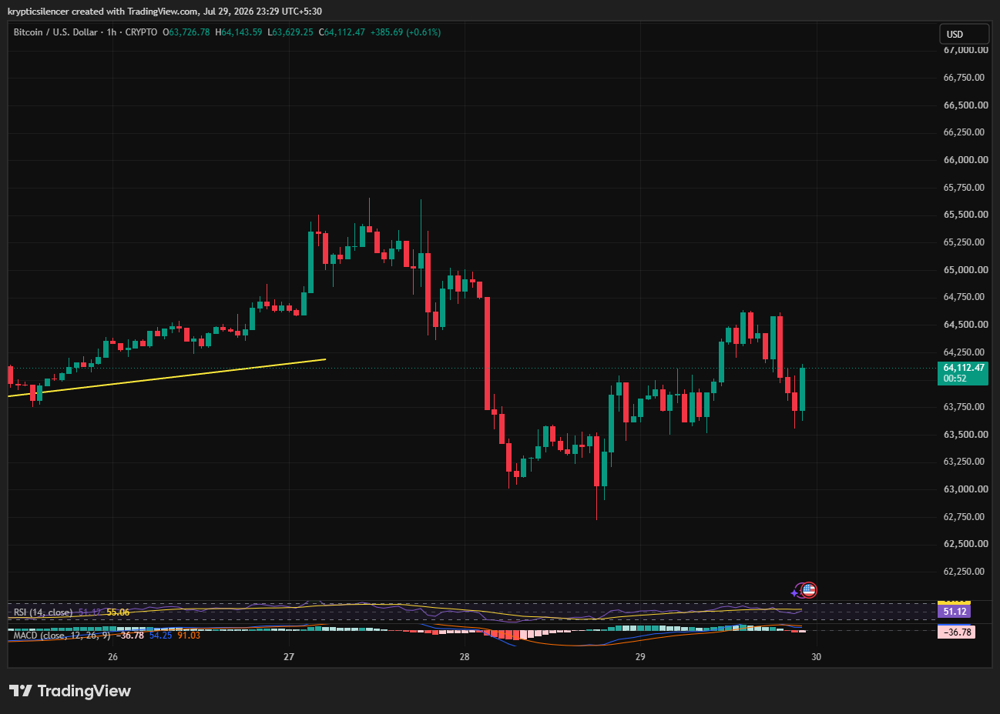

# Bitcoin — 1H Sharp Selloff Followed by Recovery Keeps Market Range-Bound

**Date:** 2026-07-29  
**Time:** ~23:29 IST  
**Instrument:** BTCUSD  
**Timeframe:** 1H  
**Venue:** CRYPTO  
**Charting Platform:** TradingView  

---

## Context

Bitcoin extended its short-term recovery before experiencing an aggressive selloff that erased multiple sessions of gains. Buyers stepped in quickly near local lows, triggering a rebound, but price remains trapped inside a broad intraday range without a clear directional breakout.

---

## Observation

### 1️⃣ Failed Bullish Momentum

* BTC attempted to continue higher after respecting an earlier ascending trendline.
* Buying pressure faded near local highs.
* Sellers regained control, leading to a sharp reversal.

The previous bullish momentum has weakened.

### 2️⃣ High-Volatility Selloff

* A series of large bearish candles accelerated the decline.
* Price dropped rapidly before finding support near the session lows.
* Volatility expanded significantly during the move.

The decline reflects strong short-term selling pressure.

### 3️⃣ Recovery Meets Resistance

* Buyers recovered a large portion of the losses.
* However, every rally has struggled to sustain above recent highs.
* Price continues to trade within a broad consolidation range.

Neither buyers nor sellers currently have full control.

### 4️⃣ RSI Returns to Neutral

* RSI has recovered toward the 50 level.
* Momentum is no longer oversold.
* Neutral RSI suggests limited directional conviction.

Momentum has stabilized after the selloff.

### 5️⃣ MACD Shows Weakening Momentum

* MACD has recovered from earlier bearish readings.
* Histogram is flattening near the zero line.
* Momentum remains mixed without a strong crossover.

Indicators support a range-bound market.

---

## Hypothesis

Bitcoin is consolidating after a high-volatility decline and recovery.

Two scenarios remain likely:

### Scenario A — Bullish Breakout

A move above recent swing highs would suggest buyers are regaining control and could initiate another upward leg.

### Scenario B — Bearish Rejection

Failure to break resistance followed by a loss of recent support would increase the probability of another move lower.

Until either level breaks, consolidation remains the dominant structure.

---

## Invalidation / Confirmation

* Break above recent highs with rising volume → bullish continuation gains credibility.
* Loss of recent support → bearish continuation becomes more likely.
* RSI holding above 50 alongside a bullish MACD crossover would strengthen the bullish case.

---

## Notes

Bitcoin has recovered well from its sharp selloff, but the market remains trapped inside a short-term range. RSI has normalized while MACD is flattening, suggesting momentum is stabilizing rather than trending. Traders should watch for a confirmed breakout before anticipating the next sustained directional move.

Text formatting and clarity were assisted by AI; the market analysis and structural interpretation are independently conducted by the author. This material is intended for educational and research documentation purposes only and does not constitute financial advice.
