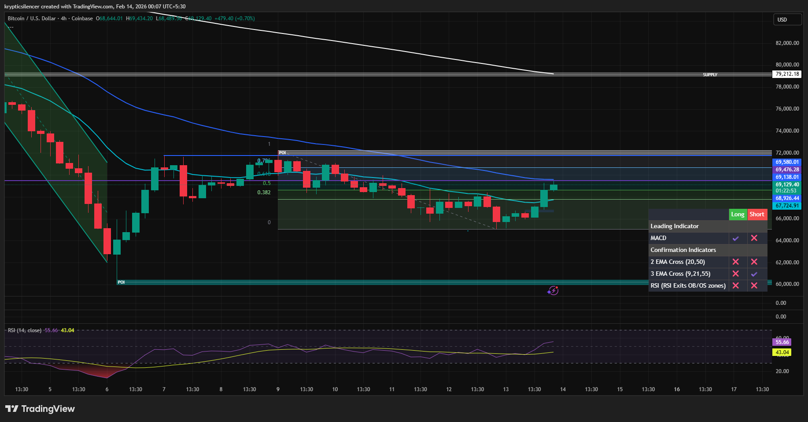

# Bitcoin — 4H Mid-Range Resistance at 0.5 Fibonacci

**Date:** 2026-02-14  
**Time:** ~00:05 IST  
**Instrument:** BTCUSD  
**Timeframe:** 4H  
**Venue:** Coinbase  
**Charting Platform:** TradingView  

---

## Context

Bitcoin is trading within a broader consolidation range following a prior impulsive decline.  
Price has rebounded from local lows and is now approaching mid-range resistance.

The market remains positioned beneath higher-timeframe supply and downward-sloping resistance.

---

## Observation

- **Fibonacci Structure:**  
  The 0.5 Fibonacci retracement level of the prior downswing is currently acting as resistance.  
  Price is reacting at this midpoint rather than reclaiming higher retracement levels.

- **Range Environment:**  
  Market remains inside a defined consolidation zone, with clear support below and supply overhead (~72k region).

- **Dynamic Resistance:**  
  Price is still trading beneath major moving averages, which are flattening but not yet signaling structural shift.

- **Momentum (RSI):**  
  RSI is recovering toward mid-range levels but has not yet established sustained bullish expansion.

---

## Hypothesis

The 0.5 Fibonacci level is functioning as a **decision zone**.

Two conditional paths:

### Scenario 1 — Rejection
Failure to reclaim and hold above 0.5 may result in renewed rotation toward lower range support.

### Scenario 2 — Acceptance
Sustained acceptance above 0.5 would increase probability of testing upper range resistance and overhead supply.

Until acceptance is confirmed, the environment remains corrective within a broader consolidation structure.

---

## Invalidation / Failure Mode

- Strong acceptance above the 0.5 level followed by higher high formation  
- Breakdown below recent higher low, confirming renewed bearish expansion  

---

## Notes

This analysis documents mid-range resistance interaction within a broader consolidation regime.

Text formatting and clarity were assisted by AI; the market analysis, structural interpretation, and scenario assessment are independently conducted by the author.  
This material is intended for educational and research documentation purposes only and does not constitute financial advice.
