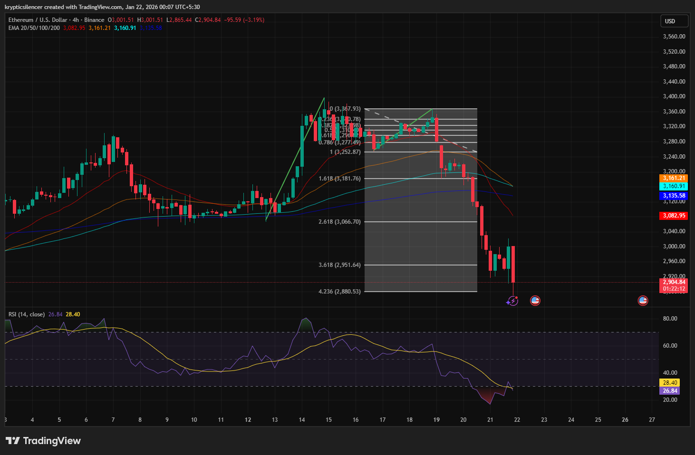

# Ethereum 4-Hour RSI Oversold and Fair Value Gap Observation

**Date:** 2026-01-22  
**Time:** 00:07 IST  
**Instrument:** ETH / USD  
**Timeframe:** 4-hour  
**Venue:** Binance  
**Charting Platform:** TradingView  

---

## Context
Ethereum experienced a sharp downside expansion on the 4-hour timeframe,
breaking below multiple medium-term moving averages and accelerating
into a high-momentum selloff.

The decline followed a failed consolidation near prior highs and resulted
in a rapid displacement to the downside.

## Observation
During the selloff, the Relative Strength Index (RSI) declined below the 30 level,
indicating a short-term oversold condition on this timeframe.

The impulsive price movement has created a noticeable fair value gap (FVG) within the previous range, which suggests a possible price inefficiency created during the displacement.

At the moment, the price is trading well below its recent value, with the relative strength index (RSI) starting to stabilize from oversold conditions.

## Hypothesis
If the downside momentum loses strength, the price may attempt to mean revert
toward the identified fair value gap to rebalance the inefficiency.

This hypothesis is subject to the stabilization of RSI and the absence of further impulsive development to the downside.
## Notes
This entry documents a momentum exhaustion and inefficiency-based
setup observed on the 4-hour timeframe.

It is recorded solely for research and pattern-recognition purposes.
No trade recommendation, prediction, or financial advice is expressed.
