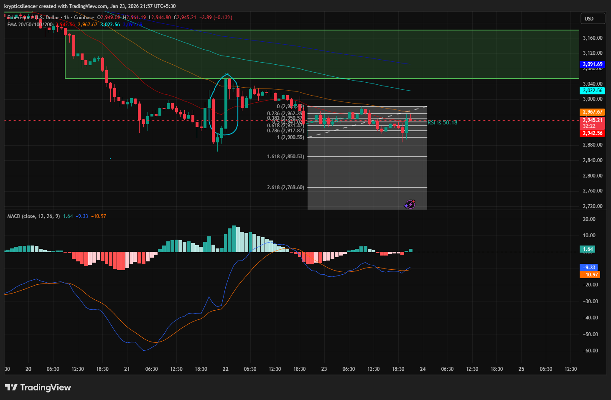

# Ethereum 1-Hour Compression and Neutral Regime Ahead of FOMC

**Date:** 2026-01-23  
**Time:** 21:57 IST  
**Instrument:** ETH / USD  
**Timeframe:** 1-hour  
**Venue:** Coinbase  
**Charting Platform:** TradingView  

---

## Context
Ethereum is currently consolidating on the 1-hour timeframe following a
prior impulsive decline from higher levels. After the selloff, price entered
a range-bound phase below descending medium-term moving averages.

This consolidation is occurring in the lead-up to the upcoming FOMC meeting,
a macro event that often coincides with reduced liquidity and suppressed
directional activity.

## Observation
Price is trading within a well-defined horizontal range, with repeated
failed attempts to sustain acceptance above the upper bound of the range.
The 
Relative Strength Index (RSI) is  near the neutral 50 level,
indicating the absence of a dominant momentum regime.

MACD shows crossovers and low-amplitude oscillations; these are frequent
with a choppy and non-trending environment and low quality of directional signals.

"A prior sharp rebound from lower levels failed to achieve follow-through."
was absorbed back into the range, suggesting that the balance had continued initiative buying.

## Hypothesis
From a “neutral” level of economic momentum, the proximity of the Fed meeting:
price remains in a state of compression before a volatility-induced expansion
Consequently,
following the event.

The issue of directional bias is left unresolved and is subject to the price “after the event.”
acceptance outside of the current consolidation range.
## Notes
This entry documents a short-term balanced and pre-event compression regime
observed on the 1-hour timeframe.

It is recorded solely for research and regime-classification purposes.
No trade recommendation, prediction, or financial advice is expressed.
