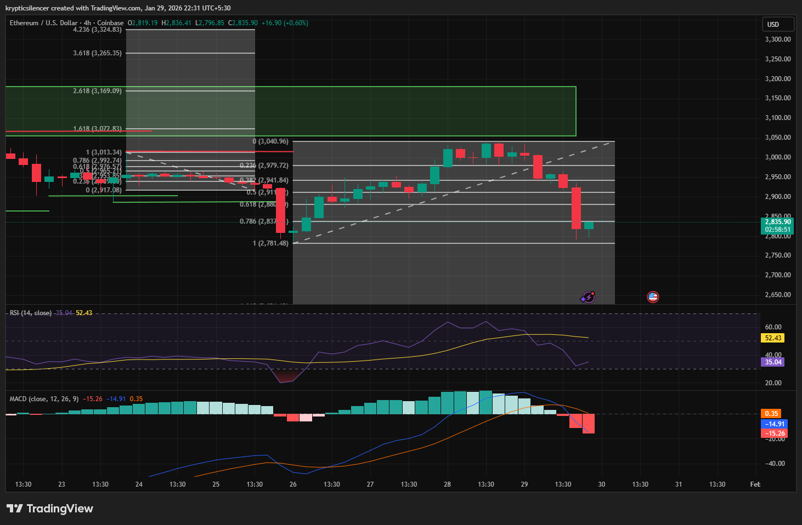

# Ethereum 4-Hour Failed FVG Interaction and Momentum Exhaustion

**Date:** 2026-01-29  
**Time:** 22:31 IST  
**Instrument:** ETH / USD  
**Timeframe:** 4-hour  
**Venue:** Coinbase  
**Charting Platform:** TradingView  

---

## Context
Ethereum has been trading in a larger corrective pattern following a previous impulsive movement. 
During this time, the price has been trying to turn around and fill a previously identified fair value gap (FVG) located above the current market.

The breakout into the FVG area lacked strong follow-through, and the price was quickly repelled after testing the area.

## Observation
Following the FVG interaction, ETH had a strong reaction to the downside,
implying a lack of acceptance in the inefficiency region.

The Relative Strength Index (RSI) on the 4-hour chart has fallen to the
low 30s, implying a loss of momentum. On lower time frames, the RSI is
much more compressed, falling to the low 20s on the 1-hour chart, which
is a sign of oversold conditions.

## Hypothesis
If selling pressure fails to accelerate further and price begins to
stabilize near current support, the recent move may resolve as a
liquidity-driven stop run or failed breakdown rather than the start of a
new impulsive leg lower.

A sustained continuation to the downside would require renewed momentum
and acceptance below current support levels.

## Notes
This entry documents a failed fair value gap interaction and multi-timeframe
momentum compression observed on the 4-hour chart.

It is recorded solely for research and pattern-recognition purposes.
No trade recommendation, prediction, or financial advice is expressed.
