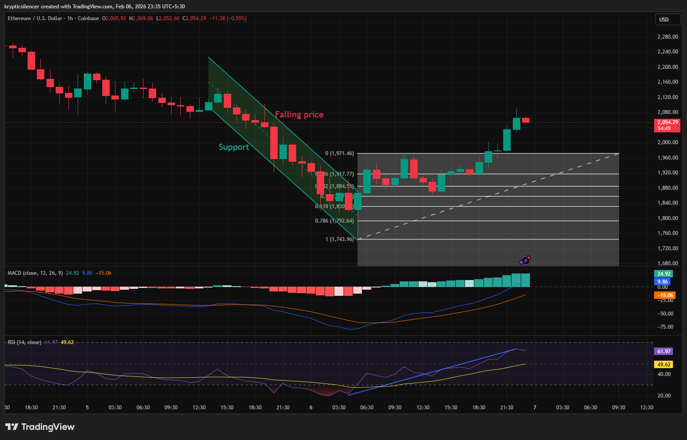

# Ethereum — 1H Support Defense & Short-Term Bullish Reversal

**Date:** 2026-02-06  
**Time:** ~23:35 IST  
**Instrument:** ETHUSD  
**Timeframe:** 1H  
**Venue:** Coinbase  
**Charting Platform:** TradingView  

---

## Context

Ethereum experienced a sustained intraday decline, forming a descending price channel and approaching a previously identified support region.  
This area coincides with prior reaction lows and acted as a decision zone for short-term price behavior.

---

## Observation

- **Support Zone Reaction:**  
  Price respected a key support region, halting the decline and producing a clear bullish response. Selling pressure diminished upon interaction with this zone, suggesting short-term demand absorption.

- **Reversal Structure:**  
  Following support defense, price formed a bullish reversal and began to retrace higher, exiting the descending channel structure.

- **Fibonacci Interaction:**  
  The rebound successfully reclaimed multiple Fibonacci retracement levels from the prior downswing, indicating strength in the corrective move rather than a shallow reaction.

- **Momentum Indicators:**  
  MACD shows improving momentum with a developing bullish crossover, while RSI has rotated higher toward the mid-range, supporting the reversal thesis.

---

## Hypothesis

The defense of support combined with Fibonacci level reclamation suggests a **short-term corrective bullish phase**.

Continuation of this move would require:
- Sustained acceptance above reclaimed retracement levels  
- Momentum holding above neutral zones  

Failure to maintain acceptance would shift focus back toward range behavior rather than trend continuation.

---

## Invalidation / Failure Mode

- Loss of the defended support zone  
- Momentum divergence with RSI failing to hold mid-range  
- Re-entry into the descending channel structure  

---

## Notes

This analysis documents a **short-term reversal within a broader corrective context** and does not assume higher-timeframe trend change.

Text formatting and clarity were assisted by AI; the market analysis, chart interpretation, and scenario construction are independently conducted by the author.  
This material is intended for educational and research documentation purposes only and does not constitute financial advice.
