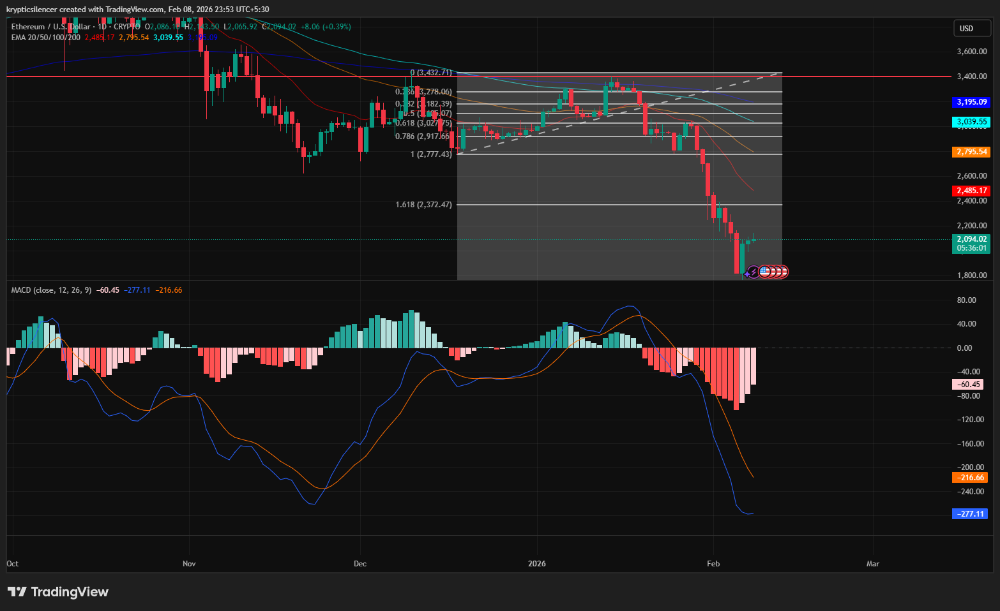

# Ethereum — 1D Breakdown From Range & Momentum Expansion

**Date:** 2026-02-08  
**Time:** ~23:55 IST  
**Instrument:** ETHUSD  
**Timeframe:** 1D  
**Venue:** Crypto / USD  
**Charting Platform:** TradingView  

---

## Context

Ethereum had been trading within a broad consolidation range on the daily timeframe, capped by major overhead resistance and supported by rising short-term structure.  
This balance phase resolved to the downside, leading to a sharp expansion lower.

Price is now trading well below key moving averages and prior range equilibrium.

---

## Observation

- **Range Resolution:**  
  Price failed to sustain acceptance near the upper boundary of the range and broke down decisively, confirming bearish resolution rather than continuation higher.

- **Moving Averages:**  
  ETH is trading below the 20, 50, 100, and 200 EMAs, all of which are now acting as dynamic resistance. This alignment reflects strong bearish control on the daily timeframe.

- **Fibonacci Extension:**  
  The sell-off extended beyond the lower retracement levels, indicating impulsive behavior rather than a controlled pullback.

- **Momentum (MACD):**  
  MACD shows aggressive downside momentum with expanding negative histogram, suggesting active trend participation rather than exhaustion at this stage.

- **Price Behavior:**  
  Recent candles show vertical expansion with limited overlap, characteristic of a momentum-driven move rather than range conditions.

---

## Hypothesis

The market has transitioned from **balance to expansion** on the daily timeframe.

As long as price remains below prior range support and key moving averages, the bias remains **bearish**, with any upside moves treated as corrective unless followed by sustained acceptance and structural reclaim.

Stabilization or consolidation may occur after such expansion, but trend invalidation would require higher-timeframe structure shift rather than short-term reaction.

---

## Invalidation / Failure Mode

- Acceptance back inside the prior daily range  
- Sustained reclaim of major moving averages  
- Momentum contraction with structural higher lows  

---

## Notes

This analysis documents a **daily timeframe bearish expansion following range failure**.

Text formatting and clarity were assisted by AI; the market analysis, chart interpretation, and scenario assessment are independently conducted by the author.  
This material is intended for educational and research documentation purposes only and does not constitute financial advice.
