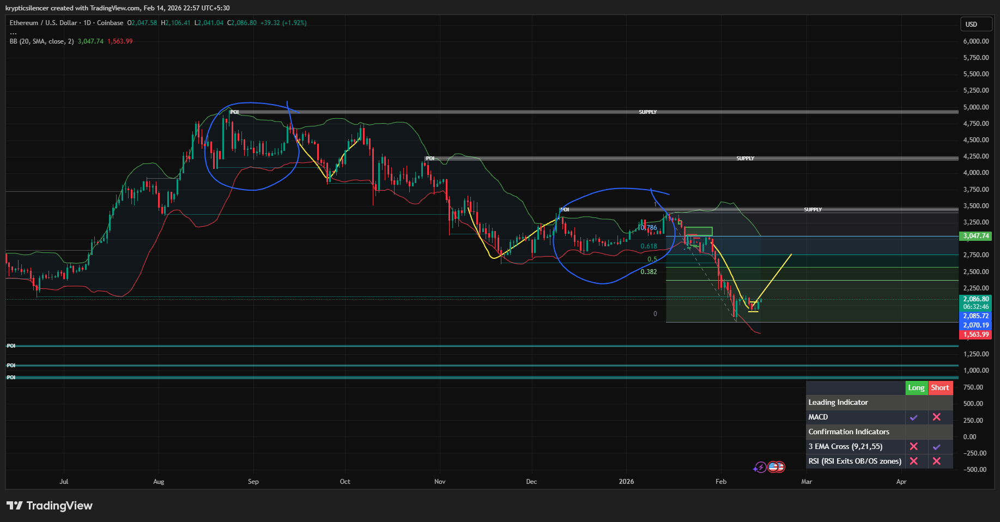

# Ethereum — 1D Potential V-Shape Recovery Setup

**Date:** 2026-02-14  
**Time:** ~23:00 IST  
**Instrument:** ETHUSD  
**Timeframe:** 1D  
**Venue:** Coinbase  
**Charting Platform:** TradingView  

---

## Context

Ethereum has experienced an aggressive downside expansion following distribution near higher supply zones.  
Price has now reached a major support region, with momentum stretched and volatility expanding.

Historically, similar impulse declines on this timeframe have resulted in sharp V-shaped recoveries.

---

## Observation

- **Prior Analogue:**  
  Previous daily sell-offs were followed by rapid upside rotations once exhaustion formed near support zones.

- **Current Structure:**  
  Price is reacting from a lower demand region after breaking through key retracement levels.

- **Fibonacci Interaction:**  
  The move extended into deeper retracement territory, suggesting capitulation behavior rather than controlled pullback.

- **Momentum:**  
  Indicators show stretched downside conditions, increasing probability of short-term rebound.

- **Supply Overhead:**  
  Multiple supply zones remain above (notably near 3.0k–3.5k region), acting as primary resistance targets in case of recovery.

---

## Hypothesis

A **V-shaped recovery attempt is possible** if:

- Price holds current demand  
- Momentum stabilizes and shifts  
- Higher lows begin forming on the daily timeframe  

Such a recovery would initially be treated as corrective unless prior supply is reclaimed with acceptance.

Failure to hold current support would invalidate the V-recovery analogue and maintain bearish continuation bias.

---

## Invalidation / Failure Mode

- Acceptance below current demand region  
- Continued expansion with no structural higher low  
- RSI failing to stabilize and remain depressed  

---

## Notes

This analysis compares current price behavior with prior daily V-shaped recovery structures.  
The setup remains conditional and dependent on support holding.

Text formatting and clarity were assisted by AI; the market analysis, structural interpretation, and scenario assessment are independently conducted by the author.  
This material is intended for educational and research documentation purposes only and does not constitute financial advice.
