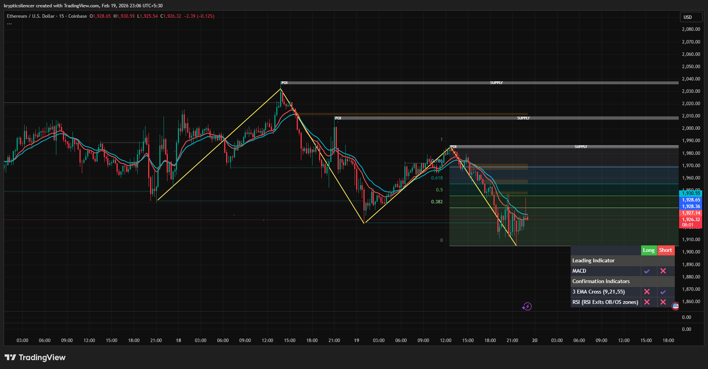

# Ethereum — 15M Lower High Formation & Continuation Setup

**Date:** 2026-02-19  
**Time:** ~23:05 IST  
**Instrument:** ETHUSD  
**Timeframe:** 15M  
**Venue:** Coinbase  
**Charting Platform:** TradingView  

---

## Context

After a prior intraday bullish leg, Ethereum transitioned into a corrective phase and failed to sustain higher highs.  
Structure has shifted from expansion to distribution and now into short-term bearish continuation.

The current environment reflects lower timeframe trend alignment to the downside.

---

## Observation

### 1️⃣ Trend Transition
- Initial impulse formed a higher high.
- Breakdown followed, creating a lower low.
- Subsequent rally formed a **lower high** near supply.

This confirms bearish structure on the 15M timeframe.

### 2️⃣ Fibonacci Interaction
- Retracement stalled near 0.618–0.786 region.
- Failure to reclaim 1.0 retracement level reinforced rejection.

### 3️⃣ Supply Confluence
- Lower high aligned with visible intraday supply.
- EMAs rolled over during rejection, supporting downside continuation.

### 4️⃣ Current Positioning
- Price returned toward prior lows.
- Structure remains intact unless lower high is reclaimed.

---

## Hypothesis

Short-term structure favors continuation while below the lower high.

Two conditional paths:

### Scenario A — Bearish Continuation
Acceptance below recent lows opens room for further downside expansion.

### Scenario B — Reclaim & Shift
Reclaim of the lower high zone would invalidate immediate bearish bias and shift structure back toward balance.

Until reclaimed, bias remains structurally bearish on 15M.

---

## Invalidation / Confirmation

- Break above lower high → structure shift.
- Continued lower highs/lows → continuation.

---

## Notes

This setup documents lower timeframe structural transition and rejection at retracement resistance.

Text formatting and clarity were assisted by AI; the market analysis and structural interpretation are independently conducted by the author.  
This material is intended for educational and research documentation purposes only and does not constitute financial advice.
