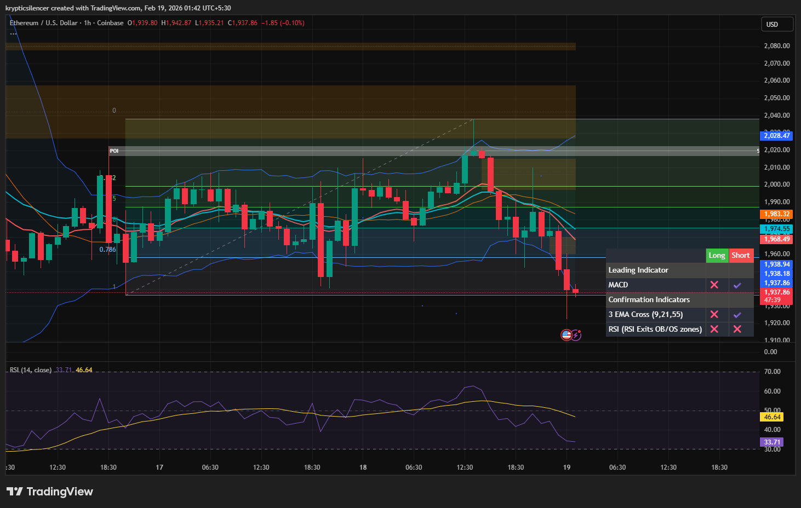

# Ethereum — 1H Range Breakdown & Momentum Shift

**Date:** 2026-02-19  
**Time:** ~01:40 IST  
**Instrument:** ETHUSD  
**Timeframe:** 1H  
**Venue:** Coinbase  
**Charting Platform:** TradingView  

---

## Context

Ethereum had been trading inside a defined intraday range following prior consolidation.  
Price attempted upside continuation toward the upper boundary but failed to establish acceptance, leading to a sharp downside rotation.

The structure has now transitioned from balance to short-term expansion.

---

## Observation

### 1️⃣ Range Structure
- Price respected a clear horizontal consolidation zone.
- Mid-range levels (0.5–0.618 retracement) acted as control area during rotation.

### 2️⃣ Failed Breakout
- Attempted push toward upper boundary met supply.
- No sustained acceptance above resistance.

### 3️⃣ Breakdown
- Range low was breached with momentum expansion.
- EMAs rolled over, confirming short-term bearish alignment.
- RSI shifted lower, reflecting downside pressure.

### 4️⃣ Liquidity Behavior
- Downside move swept prior lows before slight stabilization.
- Reaction currently occurring near lower band / structural support.

---

## Hypothesis

Market has shifted into short-term bearish expansion.

Two conditional paths:

### Scenario A — Continuation
Sustained acceptance below the former range low increases probability of further downside extension.

### Scenario B — Reclaim
Quick reclaim of the broken range and acceptance back above mid-range would invalidate the immediate bearish bias.

Until reclaimed, breakdown remains structurally valid.

---

## Invalidation / Confirmation

- Reclaim & hold above prior range low → false breakdown.
- Continued lower highs and lower lows → bearish continuation.

---

## Notes

This setup documents transition from range compression to expansion following failed breakout.

Text formatting and clarity were assisted by AI; the market analysis and structural interpretation are independently conducted by the author.  
This material is intended for educational and research documentation purposes only and does not constitute financial advice.
