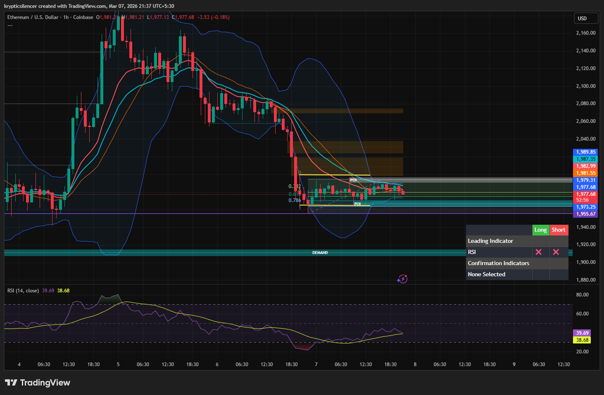

# Ethereum — 1H Range Compression Under Key Resistance

**Date:** 2026-03-07  
**Time:** ~21:30 IST  
**Instrument:** ETHUSD  
**Timeframe:** 1H  
**Venue:** Coinbase  
**Charting Platform:** TradingView  

---

## Context

Ethereum experienced a sharp downside move followed by stabilization near local support.  
After the initial decline, price entered a consolidation phase and is now moving sideways within a defined range.

The market is currently compressing beneath a clearly defined resistance level.

---

## Observation

### 1️⃣ Sideways Consolidation
- Price moving within a tight horizontal range.
- Volatility contracting after the prior impulse.
- Candles showing reduced directional momentum.

This suggests market indecision and balance.

### 2️⃣ Key Resistance Level
- The **purple horizontal line** acts as strong resistance.
- Multiple candles failing to close above this level.
- Sellers actively defending the zone.

### 3️⃣ Bollinger Band Compression
- Bands narrowing as price consolidates.
- Volatility contraction often precedes expansion.
- Price currently hovering around mid-band equilibrium.

### 4️⃣ Momentum Condition
- RSI near **39–40**, indicating weak bullish momentum.
- Slight recovery from oversold levels but still below midline.
- Momentum neutral to slightly bearish.

---

## Hypothesis

Current structure reflects compression before the next directional move.

Two conditional paths:

### Scenario A — Bullish Breakout
A strong close above the purple resistance level could trigger volatility expansion and continuation toward higher liquidity zones.

### Scenario B — Rejection & Rotation Lower
Failure to break resistance may result in renewed downside movement toward nearby support or deeper demand levels.

Until a decisive breakout occurs, price remains range-bound.

---

## Invalidation / Confirmation

- 1H close above resistance with follow-through → bullish breakout confirmed.
- Continued rejection at resistance → range continuation or downside rotation.

---

## Notes

This setup documents a consolidation phase beneath a clearly defined resistance level.  
Volatility compression suggests a directional move may occur once the range resolves.

Text formatting and clarity were assisted by AI; the market analysis and structural interpretation are independently conducted by the author.  
This material is intended for educational and research documentation purposes only and does not constitute financial advice.
