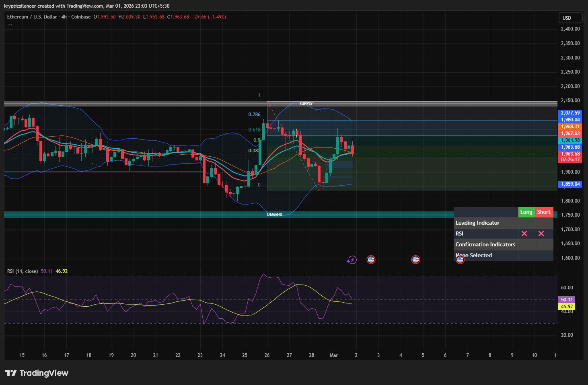

# Ethereum — 4H Rejection From Supply, Range Rotation Active

**Date:** 2026-03-01  
**Time:** ~23:00 IST  
**Instrument:** ETHUSD  
**Timeframe:** 4H  
**Venue:** Coinbase  
**Charting Platform:** TradingView  

---

## Context

Ethereum expanded impulsively from demand, reclaiming mid-range structure and pushing into higher timeframe supply.

The rally stalled near the 0.786 retracement and overhead supply zone, where prior distribution occurred.  
Since then, price has rotated lower and is now trading around equilibrium.

---

## Observation

### 1️⃣ Supply Rejection
- Strong reaction near marked supply (~2,070–2,150 region).
- Failure to sustain above 0.786 retracement.
- Upper wicks indicating seller presence in premium.

Supply remains respected on 4H.

### 2️⃣ Impulse → Correction Shift
- Initial bullish displacement from demand.
- Followed by rejection and rotation lower.
- Current candles show compression near 0.382–0.5 region.

Expansion phase has transitioned into balance.

### 3️⃣ Range Structure
- Clear demand below (~1,750 region).
- Defined supply overhead.
- Price currently oscillating between premium and discount.

Market environment resembles range rotation rather than trend continuation.

### 4️⃣ Momentum Condition
- RSI cooled from prior highs.
- No strong bullish expansion on latest bounce.
- Momentum neutralizing near equilibrium.

---

## Hypothesis

While demand initiated the recent rally, failure to break and hold above supply shifts focus to range behavior.

Two conditional paths:

### Scenario A — Continued Rotation Lower
Inability to reclaim premium may lead to deeper retracement toward discount or demand.

### Scenario B — Break & Acceptance Above Supply
Strong 4H close above supply would invalidate rotation thesis and open continuation toward higher liquidity.

Until acceptance above supply occurs, upside remains capped.

---

## Invalidation / Confirmation

- 4H close above supply with follow-through → bullish continuation.
- Formation of lower high beneath supply → range rotation toward discount confirmed.

---

## Notes

This setup documents a rejection from higher timeframe supply following an impulsive move from demand, suggesting ongoing range dynamics rather than sustained trend continuation.

Text formatting and clarity were assisted by AI; the market analysis and structural interpretation are independently conducted by the author.  
This material is intended for educational and research documentation purposes only and does not constitute financial advice.
