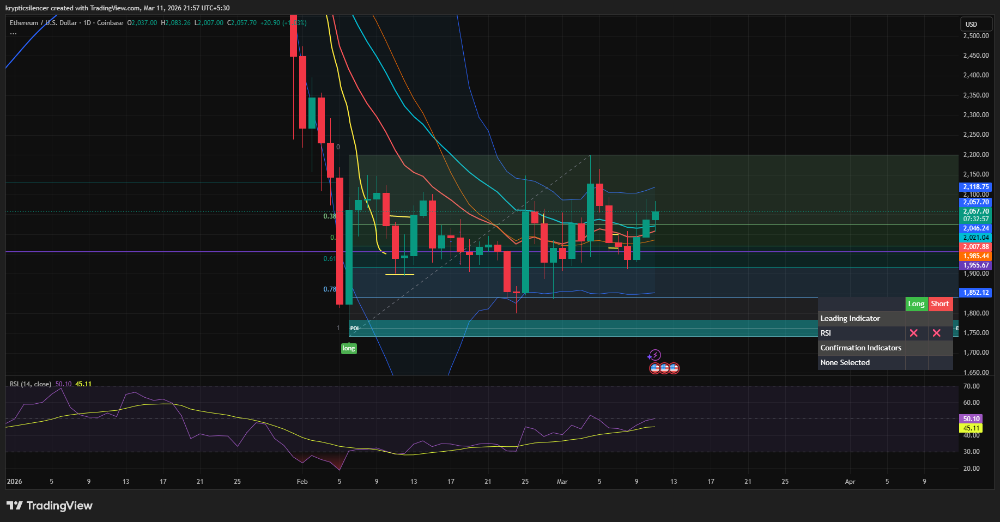

# Ethereum — Daily Sideways Structure With Short-Term Bullish Momentum

**Date:** 2026-03-11  
**Time:** ~21:55 IST  
**Instrument:** ETHUSD  
**Timeframe:** 1D  
**Venue:** Coinbase  
**Charting Platform:** TradingView  

---

## Context

Ethereum has been consolidating within a broad range following a strong corrective decline earlier in the month.  
The daily structure currently shows **sideways movement**, with price rotating between defined support and resistance levels.

Despite the range-bound environment, recent candles show signs of short-term bullish momentum.

---

## Observation

### 1️⃣ Range-Bound Structure
- Price trading inside a clear horizontal range.
- No decisive breakout above resistance or breakdown below support.
- Market currently balancing between premium and discount.

### 2️⃣ Recent Bullish Momentum
- Last **three daily candles closed bullish**.
- Buyers showing short-term strength after stabilization near support.
- Price gradually reclaiming equilibrium within the range.

### 3️⃣ RSI Momentum
- RSI currently around **50**, indicating neutral momentum.
- RSI rising gradually after recovering from lower levels.
- Momentum slightly favoring buyers but not yet strong.

### 4️⃣ Volatility Condition
- Bollinger Bands relatively stable, indicating reduced directional expansion.
- Current move resembles gradual recovery rather than impulsive breakout.

---

## Hypothesis

While the broader market remains sideways, short-term momentum favors mild bullish continuation.

Two conditional paths:

### Scenario A — Range High Test
Continued bullish candles may push price toward the upper boundary of the range.

### Scenario B — Continued Consolidation
Failure to build momentum may keep price rotating within the established range.

Until a breakout occurs, range dynamics remain dominant.

---

## Invalidation / Confirmation

- Strong daily close above range resistance → bullish breakout confirmed.
- Bearish rejection from mid-range → continuation of sideways rotation.

---

## Notes

This setup highlights a **range-bound market structure on the daily timeframe**, with recent bullish candles suggesting short-term strength within the broader consolidation.

Text formatting and clarity were assisted by AI; the market analysis and structural interpretation are independently conducted by the author.  
This material is intended for educational and research documentation purposes only and does not constitute financial advice.
