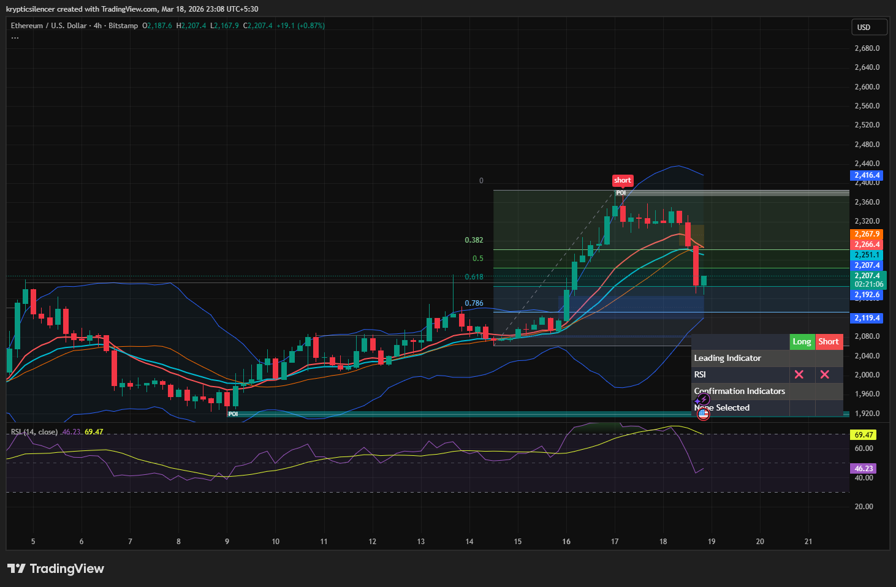

# Ethereum — 4H Rejection at Supply & Pullback into Value

**Date:** 2026-03-18  
**Time:** ~23:08 IST  
**Instrument:** ETHUSD  
**Timeframe:** 4H  
**Venue:** Bitstamp  
**Charting Platform:** TradingView  

---

## Context

Ethereum showed a strong bullish expansion, pushing into a higher timeframe supply zone.  
Momentum has slowed as price reaches premium levels.

---

## Observation

### 1️⃣ Impulsive Move
- Strong bullish leg with clean higher highs.
- Price accelerated into a premium zone.

### 2️⃣ Supply Interaction
- Clear rejection from upper supply region.
- Sellers stepped in near the top.

### 3️⃣ Fibonacci Reaction
- Price pulling back toward 0.5–0.618 zone.
- Indicates rebalancing after impulsive move.

### 4️⃣ RSI Behavior
- RSI previously near overbought (~69).
- Now cooling, supporting short-term pullback.

---

## Hypothesis

### Scenario A — Pullback into Value (Most Likely)
Price continues retracement toward 0.618 / demand zone before potential continuation.

### Scenario B — Immediate Bounce
If buyers defend current levels, ETH may consolidate and attempt another push upward.

---

## Invalidation / Confirmation

- Break below demand → deeper correction.
- Strong reclaim above supply → continuation.

---

## Notes

This setup reflects a typical post-impulse behavior where price corrects after hitting supply and overextended RSI.

Text formatting and clarity were assisted by AI; the market analysis and structural interpretation are independently conducted by the author.  
This material is intended for educational and research documentation purposes only and does not constitute financial advice.
