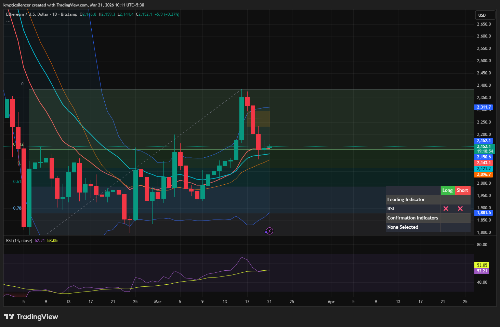

# Ethereum — Daily FVG Presence & Short-Term Bullish Momentum

**Date:** 2026-03-21  
**Time:** ~10:11 IST  
**Instrument:** ETHUSD  
**Timeframe:** 1D  
**Venue:** Bitstamp  
**Charting Platform:** TradingView  

---

## Context

Ethereum is currently trading within a broader range on the daily timeframe.  
After a recent impulsive move upward, price is now stabilizing within value.

---

## Observation

### 1️⃣ Fair Value Gap (FVG)
- A Fair Value Gap is visible from the recent impulsive bullish move.
- Price is currently trading within/near this imbalance area.

### 2️⃣ Momentum Shift
- Short-term bullish momentum observed after recent bearish candles.
- Buyers are attempting to regain control in the short term.

### 3️⃣ RSI Position
- RSI around ~53, indicating neutral-to-bullish momentum.
- No overbought conditions yet.

### 4️⃣ Structure
- Price holding above mid-range of the move.
- Indicates potential continuation if momentum sustains.

---

## Hypothesis

### Scenario A — Continuation Through FVG
Price may continue moving upward through the imbalance toward higher resistance.

### Scenario B — FVG Rebalance
Price may retrace deeper into the FVG before continuation.

---

## Invalidation / Confirmation

- Breakdown below FVG → bearish continuation.
- Higher highs on daily → confirms bullish continuation.

---

## Notes

This setup reflects a typical imbalance scenario where price interacts with a Fair Value Gap before deciding continuation or deeper retracement.

Text formatting and clarity were assisted by AI; the market analysis and structural interpretation are independently conducted by the author.  
This material is intended for educational and research documentation purposes only and does not constitute financial advice.
