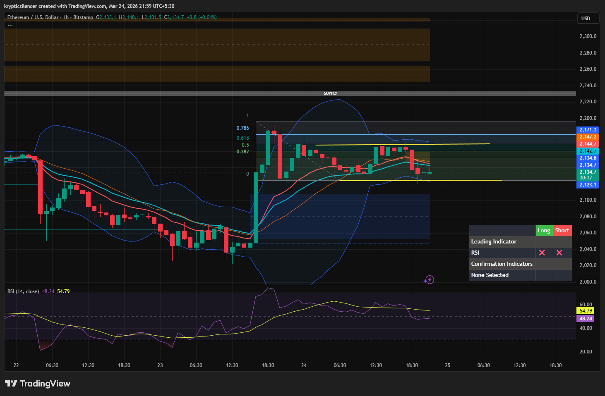

# Ethereum — 1H Large FVG & Range Compression

**Date:** 2026-03-24  
**Time:** ~21:59 IST  
**Instrument:** ETHUSD  
**Timeframe:** 1H  
**Venue:** Bitstamp  
**Charting Platform:** TradingView  

---

## Context

Ethereum formed a large Fair Value Gap after a strong impulsive move.  
Price is now consolidating within the imbalance area.

---

## Observation

### 1️⃣ Fair Value Gap (FVG)
- Large imbalance created from the impulsive bullish move.
- Price currently trading inside the FVG.

### 2️⃣ Fibonacci Range Behavior
- Price moving sideways between the 0 and 0.5 Fibonacci levels.
- Indicates consolidation within the range.

### 3️⃣ Bollinger Band Compression
- Bollinger Bands tightening and moving closer to price.
- This usually indicates volatility compression and a potential breakout soon.

### 4️⃣ Structure
- No clear trend currently — price moving sideways.
- Market in balance phase after impulse.

---

## Hypothesis

### Scenario A — Breakout Upward
If price breaks above 0.5 Fib and holds, price may move toward the supply zone.

### Scenario B — Breakdown
If price loses the 0 Fib level, price may move downward to rebalance deeper inefficiencies.

---

## Invalidation / Confirmation

- Break and hold above 0.5 Fib → bullish continuation.
- Break below 0 Fib → bearish move.

---

## Notes

This setup reflects a classic volatility compression inside a Fair Value Gap, which often leads to an expansion move after consolidation.

Text formatting and clarity were assisted by AI; the market analysis and structural interpretation are independently conducted by the author.  
This material is intended for educational and research documentation purposes only and does not constitute financial advice.
