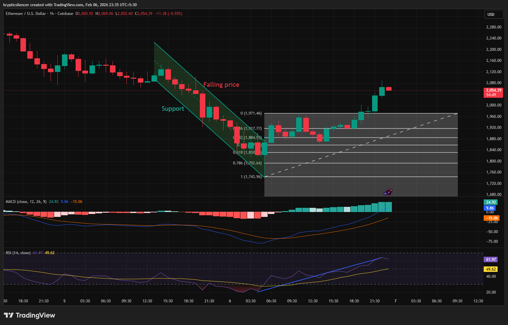

# Ethereum — FVG Refill & Oversold RSI (Potential Bullish Reaction)

**Date:** 2026-03-26  
**Timeframe:** 1H  
**Instrument:** ETHUSD  

---

## Context

Ethereum has retraced downward after rejecting from the upper range and is now moving into a previous Fair Value Gap (FVG). At the same time, RSI has entered oversold territory, indicating weakening bearish momentum.

---

## Observation

### 1️⃣ Fair Value Gap (FVG)
- Price retraced into a previous imbalance area.
- Market often revisits FVGs to rebalance price before the next move.

### 2️⃣ RSI Oversold
- RSI below 30 indicates oversold conditions.
- Suggests selling pressure may be exhausting.

### 3️⃣ Structure
- Current move is a retracement, not an impulsive breakdown.
- Price entering a reaction zone.

---

## Hypothesis

### Scenario A — Bullish Reaction
If price holds inside the FVG and buyers step in, ETH may bounce toward mid-range and possibly retest supply.

### Scenario B — Bearish Continuation
If price fails to hold this zone, ETH may continue downward toward the next demand level.

---

## Invalidation / Confirmation

- Strong bullish candles + RSI recovery → confirms bounce.
- Continued bearish structure → confirms continuation downward.

---

## Notes

This setup shows a confluence between Fair Value Gap refill and RSI oversold conditions, which often leads to a short-term bullish reaction.

This material is for educational and research documentation purposes only and does not constitute financial advice.
