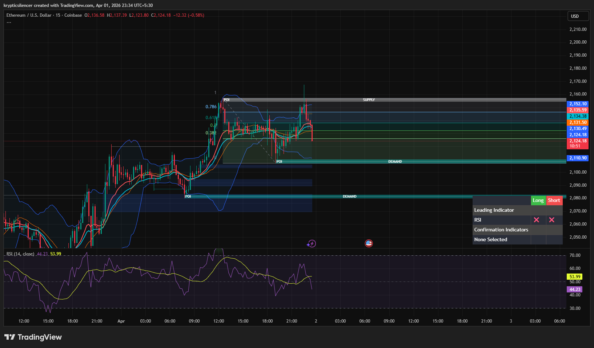

# Ethereum — Rejection From Supply, Short-Term Bearish Reversal

**Date:** 2026-04-01  
**Timeframe:** 15M  
**Instrument:** ETHUSD  

---

## Context

Ethereum moved upward into a supply zone and faced rejection. Price is now moving downward from supply, indicating a potential short-term bearish reversal.

---

## Observation

### 1️⃣ Supply Zone Reaction
- Price moved into a marked supply zone and got rejected.
- This indicates selling pressure at higher levels.

### 2️⃣ Fibonacci Levels
- Price failed to hold higher Fibonacci levels and started moving downward.
- This suggests the move upward was a retracement rather than a breakout.

### 3️⃣ Market Structure (Lower Timeframe)
- Short-term structure starting to turn bearish.
- Potential formation of lower high.

### 4️⃣ RSI
- RSI around mid-range (~44–53) and starting to turn downward.
- Indicates weakening bullish momentum.

---

## Hypothesis

### Scenario A — Short-Term Bearish Move
Price may move downward toward the demand zone below.

### Scenario B — False Rejection
If price reclaims the supply zone and holds above it, bullish continuation may occur.

---

## Invalidation / Confirmation

- Continued rejection → confirms bearish move.
- Break and hold above supply → invalidates bearish setup.

---

## Notes

This setup shows a typical supply rejection leading to a short-term bearish move toward demand.

This material is for educational and research documentation purposes only and does not constitute financial advice.
