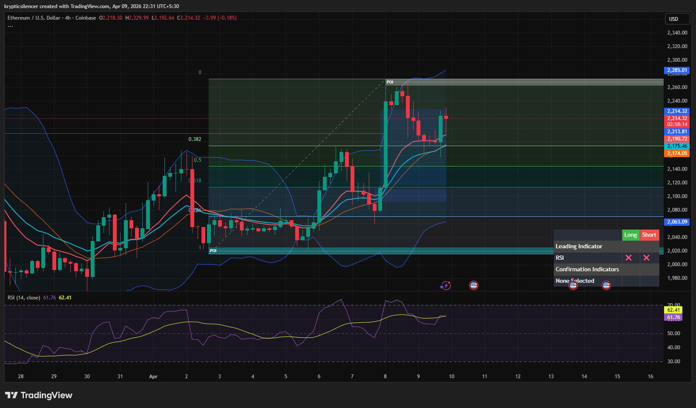

# Ethereum — 4H Bullish Expansion Into Supply With Pullback

**Date:** 2026-04-09  
**Time:** ~22:31 IST  
**Instrument:** ETHUSD  
**Timeframe:** 4H  
**Venue:** Coinbase  
**Charting Platform:** TradingView  

---

## Context

Ethereum showed a strong bullish expansion from a demand/POI zone, followed by a move into a higher timeframe supply region. After tapping this area, price is now pulling back, indicating a transition from expansion to short-term retracement.

---

## Observation

- **Market Structure:**  
  Short-term structure is bullish with higher highs and higher lows, but currently experiencing a pullback after rejection from supply.

- **Impulsive Move:**  
  A strong bullish impulse pushed price from demand (~2060 area) into supply (~2260+), indicating aggressive buying.

- **Supply Zone:**  
  Price tapped the supply/POI zone and faced rejection, leading to the current retracement.

- **Fibonacci Retracement:**  
  Price is pulling back into the 0.382–0.5 region, a typical retracement zone within a bullish trend.

- **Momentum (RSI):**  
  RSI remains elevated and holding above midline, suggesting bullish momentum is still intact despite the pullback.

---

## Hypothesis

The market is in a **bullish trend with a corrective pullback** after tapping supply.

Two conditional paths:

### Scenario 1 — Continuation After Pullback
If price holds the retracement zone and forms a higher low, continuation toward and potentially beyond supply is likely.

### Scenario 2 — Deeper Retracement
If price loses the retracement support, a deeper move toward demand (~2060) may occur before any further upside.

---

## Invalidation / Failure Mode

- Breakdown below key demand zone (~2060)  
- Loss of higher low structure  
- RSI dropping below midline with bearish continuation  

---

## Notes

This analysis documents a **bullish expansion followed by a corrective pullback into retracement levels**, not a confirmed trend reversal.

Text formatting and clarity were assisted by AI; the market analysis, chart interpretation, and structural assessment are independently conducted by the author.  
This material is intended for educational and research documentation purposes only and does not constitute financial advice.
