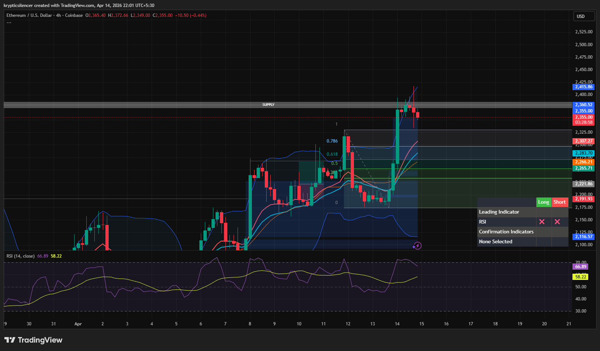

# Ethereum — 4H Bearish Imbalance With Rebalancing Attempt

**Date:** 2026-04-14  
**Time:** ~22:01 IST  
**Instrument:** ETHUSD  
**Timeframe:** 4H  
**Venue:** Coinbase  
**Charting Platform:** TradingView  

---

## Context

Ethereum experienced a strong bullish expansion into a higher timeframe supply zone, followed by a sharp bearish reaction. The impulsive move downward created a large imbalance (Fair Value Gap), with price now attempting to rebalance this inefficiency.

---

## Observation

- **Market Structure:**  
  Short-term structure shows a sharp rejection from supply followed by bearish momentum, though price is attempting a recovery.

- **Impulsive Move & FVG:**  
  The aggressive sell-off created a large FVG, indicating inefficiency in price delivery. This zone is now acting as a magnet for price.

- **Rebalancing Behavior:**  
  Price is attempting to move back upward into the imbalance, suggesting partial fill of the FVG.

- **Supply Zone:**  
  Overhead supply (~2360+) remains intact, where the initial rejection occurred.

- **Momentum (RSI):**  
  RSI shows bearish momentum after the drop, but is stabilizing as price attempts recovery.

---

## Hypothesis

The market is currently in a **rebalancing phase within a bearish impulse**.

Two conditional paths:

### Scenario 1 — Partial Rebalance & Rejection
If price fills the FVG and rejects, continuation to the downside is likely, maintaining bearish pressure.

### Scenario 2 — Full Rebalance & Shift
If price fully reclaims the imbalance and holds above it, a shift back toward bullish continuation may occur.

---

## Invalidation / Failure Mode

- Strong acceptance above supply zone  
- Formation of higher highs beyond prior rejection  
- RSI reclaiming strong bullish momentum  

---

## Notes

This analysis documents a **bearish impulse creating a large imbalance, followed by a rebalancing attempt**, not a confirmed trend reversal.

Text formatting and clarity were assisted by AI; the market analysis, chart interpretation, and structural assessment are independently conducted by the author.  
This material is intended for educational and research documentation purposes only and does not constitute financial advice.
