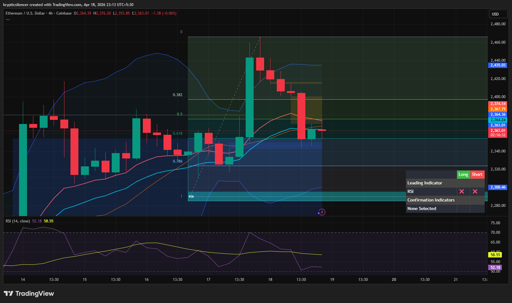

# Ethereum — 4H Recovery Attempt After Correction

**Date:** 2026-04-18  
**Time:** ~23:13 IST  
**Instrument:** ETHUSD  
**Timeframe:** 4H  
**Venue:** Coinbase  
**Charting Platform:** TradingView  

---

## Context

Ethereum experienced a corrective move following a prior bullish expansion. After the pullback, price is now attempting to stabilize and recover, indicating a potential continuation phase if momentum returns.

---

## Observation

- **Market Structure:**  
  Short-term structure shows a pullback followed by stabilization, with price attempting to form a higher low.

- **Correction Phase:**  
  The recent move downward acted as a retracement into key Fibonacci levels, resetting momentum.

- **Recovery Attempt:**  
  Price is now pushing upward from the 0.5–0.618 region, suggesting a potential continuation attempt.

- **Momentum (RSI):**  
  RSI has cooled off from higher levels and is now stabilizing near midline, indicating neutral-to-bullish recovery conditions.

- **Moving Averages:**  
  Price is interacting around key moving averages, showing indecision but potential support.

---

## Hypothesis

The market is in a **recovery phase after correction**.

Two conditional paths:

### Scenario 1 — Continuation
If price holds above the retracement zone and builds higher lows, continuation toward prior highs is likely.

### Scenario 2 — Failed Recovery
If price fails to sustain above current levels, a deeper retracement toward demand may occur.

---

## Invalidation / Failure Mode

- Breakdown below recent support / retracement zone  
- Loss of higher low structure  
- RSI dropping below midline with bearish continuation  

---

## Notes

This analysis documents a **post-correction recovery attempt**, not a confirmed bullish continuation.

Text formatting and clarity were assisted by AI; the market analysis, chart interpretation, and structural assessment are independently conducted by the author.  
This material is intended for educational and research documentation purposes only and does not constitute financial advice.
