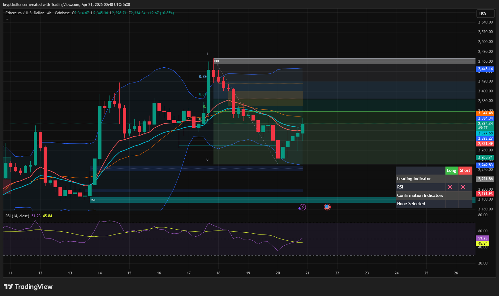

# Ethereum — 4H Recovery From Range Low After Bearish Move

**Date:** 2026-04-21  
**Time:** ~00:40 IST  
**Instrument:** ETHUSD  
**Timeframe:** 4H  
**Venue:** Coinbase  
**Charting Platform:** TradingView  

---

## Context

Ethereum experienced a bearish move from a supply/POI zone, followed by a decline toward range lows. After reaching the lower boundary, price is now showing signs of recovery, indicating a potential rebalancing phase.

---

## Observation

- **Market Structure:**  
  Short-term structure shifted bearish after rejection, but current price action shows a potential base forming near range lows.

- **Bearish Move:**  
  Price moved down impulsively from the supply region (~2450 area), creating a clear leg lower.

- **Range Low Reaction:**  
  Price reacted from the 0 level / demand zone (~2250), suggesting presence of buyers.

- **Recovery Attempt:**  
  Price is now moving upward, attempting to reclaim the 0.382–0.5 retracement region.

- **Momentum (RSI):**  
  RSI is recovering from lower levels and approaching midline, indicating improving momentum.

---

## Hypothesis

The market is in a **recovery phase after a bearish move**.

Two conditional paths:

### Scenario 1 — Rebalancing Continuation
If price holds above the recent low and continues forming higher lows, a move toward mid-range or supply is likely.

### Scenario 2 — Failed Recovery
If price fails to sustain the recovery and breaks below the range low, further downside continuation may occur.

---

## Invalidation / Failure Mode

- Breakdown below demand / range low (~2250)  
- Continued formation of lower lows  
- RSI losing recovery and turning bearish  

---

## Notes

This analysis documents a **recovery attempt from range lows after a bearish move**, not a confirmed bullish trend reversal.

Text formatting and clarity were assisted by AI; the market analysis, chart interpretation, and structural assessment are independently conducted by the author.  
This material is intended for educational and research documentation purposes only and does not constitute financial advice.
