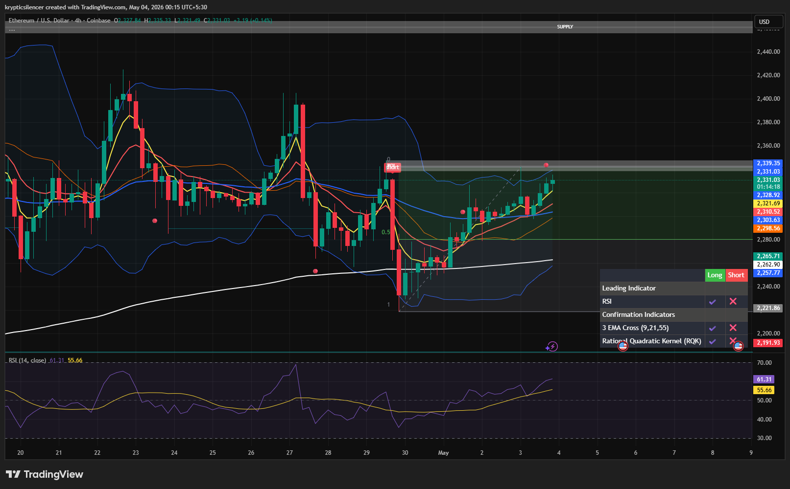

# Ethereum — 4H Recovery Into Local Supply

**Date:** 2026-05-04  
**Time:** ~00:15 IST  
**Instrument:** ETHUSD  
**Timeframe:** 4H  
**Venue:** Coinbase  
**Charting Platform:** TradingView  

---

## Context

Ethereum has recovered steadily from the recent local low and is now trading back into a defined supply zone on the 4H timeframe.

Price has reclaimed short-term structure, but is now approaching a key overhead resistance area where seller response becomes likely.

---

## Observation

- **Market Structure:**  
  ETH has shifted into a short-term bullish recovery, printing higher lows and steady upward continuation.

- **Recovery Leg:**  
  Price has reclaimed local structure cleanly after the downside sweep and continues to push higher.

- **Supply Test:**  
  ETH is now trading directly beneath local supply, where prior selling pressure was previously active.

- **Momentum (RSI):**  
  RSI is rising with bullish momentum, but is approaching elevated territory as price tests resistance.

---

## Hypothesis

Ethereum remains bullish in the short term, but price is now approaching a key decision zone.

### Scenario 1 — Bullish Break
If ETH reclaims the local supply zone with acceptance, continuation toward higher resistance becomes likely.

### Scenario 2 — Rejection
Failure to break supply may trigger a short-term pullback into reclaimed support before continuation.

---

## Invalidation / Failure Mode

- Sharp rejection with loss of reclaimed structure  
- Failure to hold above local support after pullback  
- Breakdown back below the recovery base  

---

## Notes

This setup reflects a **bullish recovery into local supply**, with continuation possible if resistance is reclaimed cleanly.

Text formatting and clarity were assisted by AI; the market analysis, chart interpretation, and structural assessment are independently conducted by the author.  
This material is intended for educational and research documentation purposes only and does not constitute financial advice.
