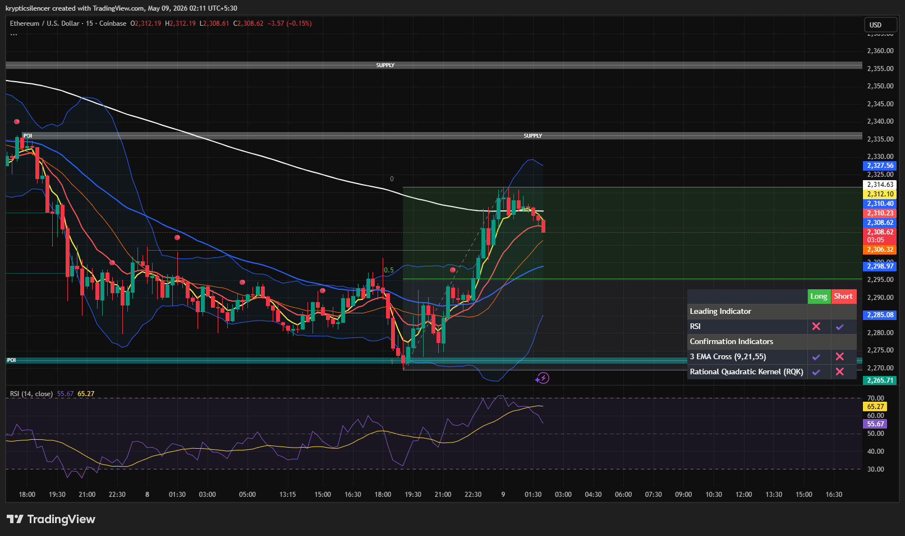

# Ethereum — 15M Rejection Near Local Supply

**Date:** 2026-05-09  
**Time:** 02:11 IST  
**Instrument:** ETHUSD  
**Timeframe:** 15M  
**Venue:** Coinbase  
**Charting Platform:** TradingView  

---

## Context

Ethereum staged a strong recovery from local lows and reclaimed short-term bullish structure. After the impulsive move higher, price is now reacting near a nearby supply zone, showing signs of short-term exhaustion.

---

## Observation

- **Market Structure:**  
Short-term structure remains bullish after the recent reversal from demand.

- **Supply Zone:**  
ETH is reacting below the highlighted supply region (~2335–2355), where selling pressure is beginning to emerge.

- **Support Zone:**  
The mid-range area near the 0.5 level remains the key short-term support for maintaining bullish continuation.

- **Momentum Condition:**  
RSI has started fading from elevated levels, indicating cooling momentum after the rapid expansion.

- **Trend Condition:**  
Price remains above short-term EMAs, though momentum is slowing as ETH approaches resistance.

---

## Hypothesis

ETH is likely entering a **short-term consolidation or pullback phase** after the recent bullish expansion.

Two conditional paths:

### Scenario 1 — Pullback Then Continuation  
If ETH holds mid-range support and stabilizes, continuation toward higher supply remains likely.

### Scenario 2 — Rejection Into Deeper Retrace  
If support fails, ETH may rotate back into the broader value area before attempting another upside move.

---

## Invalidation / Failure Mode

- Breakdown below mid-range support with acceptance  
- Loss of bullish EMA structure  
- RSI weakening below neutral without recovery  
- Failure to reclaim support after pullback

---

## Notes

Current weakness appears corrective rather than fully bearish, as ETH remains structurally bullish after reclaiming local support. The key focus is whether buyers defend the mid-range support region during this cooldown phase.

This material is intended for educational and observational purposes only and does not constitute financial advice.
