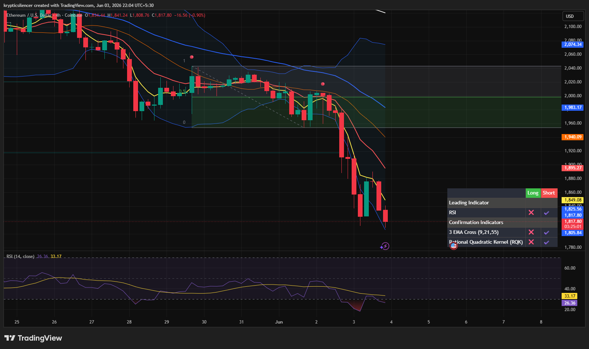

# Ethereum — 4H Evening Star Breakdown & Bearish Expansion

**Date:** 2026-06-03
**Time:** ~22:04 IST
**Instrument:** ETHUSD
**Timeframe:** 4H
**Venue:** Coinbase
**Charting Platform:** TradingView

---

## Context

Ethereum spent several sessions consolidating within a corrective range following a prior decline. Price repeatedly failed to reclaim higher resistance levels, resulting in weakening bullish momentum beneath the broader bearish structure.

The consolidation phase ultimately resolved to the downside, triggering a sharp bearish expansion and a significant breakdown below key support.

---

## Observation

### 1️⃣ Evening Star Reversal Pattern

* A clear Evening Star formation developed near the upper portion of the consolidation range.
* Initial bullish advance was followed by indecision and subsequent aggressive selling pressure.
* The pattern formed directly beneath overhead resistance and dynamic EMA resistance.

This provided an early warning of bearish reversal risk.

### 2️⃣ Breakdown From Consolidation

* Price lost range support decisively.
* Multiple large bearish candles created strong downside displacement.
* Previous consolidation lows offered little support during the decline.

The breakdown confirms seller dominance and acceptance below prior value.

### 3️⃣ EMA Structure

* All major EMAs remain bearishly aligned.
* Price accelerated further below the EMA cluster during the selloff.
* Dynamic resistance continues to trend downward.

This reflects strong trend continuation conditions rather than a temporary pullback.

### 4️⃣ Momentum Collapse

* RSI plunged toward oversold territory near the mid-20s.
* Momentum remains heavily skewed toward sellers.
* No meaningful bullish divergence is currently visible.

The momentum profile supports continuation rather than immediate reversal.

### 5️⃣ Volatility Expansion

* Candle size expanded significantly during the breakdown.
* Selling pressure increased as support levels failed.
* Market participants aggressively exited positions after the structure break.

This is characteristic of a high-conviction bearish move.

---

## Hypothesis

Ethereum remains in a strong bearish continuation phase following confirmation of the Evening Star reversal and subsequent range breakdown.

Two conditional paths remain active:

### Scenario A — Bearish Continuation

Continued acceptance below broken support may drive price toward deeper liquidity zones as sellers maintain control and momentum remains negative.

### Scenario B — Oversold Relief Bounce

Given the aggressive decline and oversold RSI conditions, a short-term corrective bounce into EMA resistance is possible. However, any recovery that fails to reclaim broken support would likely be viewed as a continuation setup rather than a trend reversal.

Until market structure is reclaimed, bearish conditions remain dominant.

---

## Invalidation / Confirmation

* Reclaim of broken support and EMA resistance → bearish thesis weakens.
* Lower high formation followed by fresh lows → bearish continuation confirmed.
* Sustained trading beneath former range support → breakdown remains valid.

---

## Notes

This setup demonstrates a textbook Evening Star reversal occurring beneath resistance, followed by a decisive breakdown from consolidation and aggressive bearish expansion. The combination of bearish candle structure, EMA alignment, and oversold momentum reinforces the current downside bias while leaving room for short-term relief rallies.

Text formatting and clarity were assisted by AI; the market analysis and structural interpretation are independently conducted by the author.
This material is intended for educational and research documentation purposes only and does not constitute financial advice.
