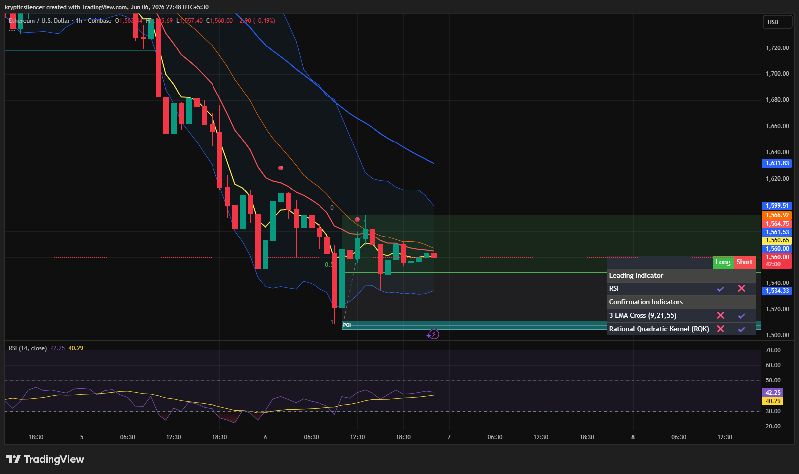

# Ethereum — 1H Consolidation Above Demand After Capitulation

**Date:** 2026-06-06
**Time:** ~22:48 IST
**Instrument:** ETHUSD
**Timeframe:** 1H
**Venue:** Coinbase
**Charting Platform:** TradingView

---

## Context

Following a sharp capitulation move that drove Ethereum into a major demand zone, selling pressure has begun to stabilize.

Price is no longer making aggressive new lows and has transitioned into a consolidation phase above demand, suggesting a temporary balance between buyers and sellers after the recent breakdown.

---

## Observation

### 1️⃣ Demand Zone Defense

* Price reacted strongly from the marked demand region near local lows.
* Buyers successfully prevented immediate continuation lower.
* Multiple candles continue to close above the support zone.

Demand remains respected in the short term.

### 2️⃣ Compression Structure

* Recent price action has become increasingly sideways.
* Volatility has contracted significantly compared to the prior selloff.
* Candles are overlapping, indicating indecision.

This behavior is characteristic of a market searching for direction after a large impulse move.

### 3️⃣ EMA Structure

* Price remains beneath higher timeframe EMA resistance.
* Fast EMAs have flattened after the decline.
* No confirmed bullish EMA expansion has formed.

The broader trend remains bearish despite short-term stabilization.

### 4️⃣ Momentum Recovery

* RSI recovered from oversold territory and returned toward neutral levels.
* Momentum has improved compared to the capitulation low.
* However, RSI remains below strong bullish expansion territory.

This suggests recovery rather than reversal.

### 5️⃣ Range Development

* Price is oscillating between demand support and nearby resistance.
* Neither buyers nor sellers have achieved decisive control.
* Current action resembles accumulation of liquidity before expansion.

A breakout from this compression may determine the next directional move.

---

## Hypothesis

Ethereum is currently consolidating after a major bearish impulse while attempting to build support above demand.

Two conditional paths remain active:

### Scenario A — Relief Rally

A breakout above local resistance and EMA compression could trigger a short-term recovery toward higher liquidity zones and dynamic resistance levels.

### Scenario B — Bearish Continuation

Failure to maintain the demand zone would invalidate the stabilization thesis and expose Ethereum to another wave of downside expansion.

Until resistance is reclaimed, the broader market structure remains bearish despite improving short-term conditions.

---

## Invalidation / Confirmation

* Break above local resistance and EMA cluster → recovery thesis strengthens.
* Loss of demand support → bearish continuation confirmed.
* Higher low formation above demand → stabilization remains valid.

---

## Notes

This setup reflects a post-capitulation consolidation phase where demand has successfully halted immediate downside momentum. While the broader trend remains bearish, the market is showing signs of stabilization, making the current range an important area for determining whether Ethereum develops a relief rally or resumes its downtrend.

Text formatting and clarity were assisted by AI; the market analysis and structural interpretation are independently conducted by the author.
This material is intended for educational and research documentation purposes only and does not constitute financial advice.
