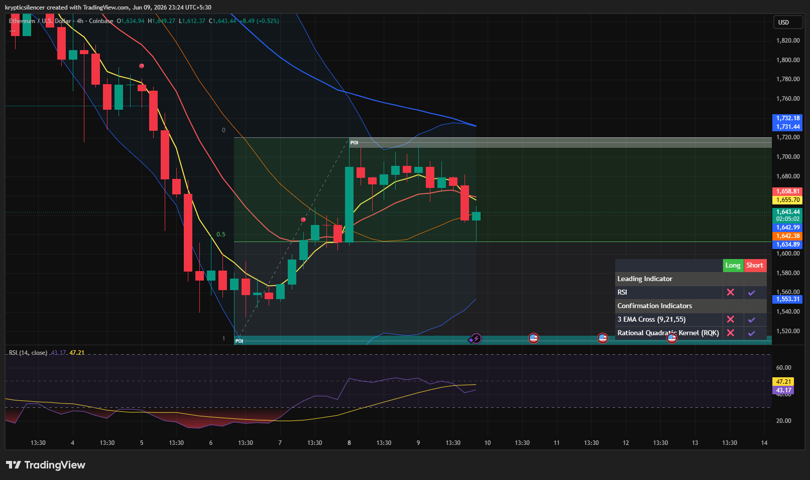

# Ethereum — 4H Recovery Stalls Beneath Supply Resistance

**Date:** 2026-06-09
**Time:** ~23:24 IST
**Instrument:** ETHUSD
**Timeframe:** 4H
**Venue:** Coinbase
**Charting Platform:** TradingView

---

## Context

Ethereum staged a strong recovery from the major demand zone after the recent capitulation event, successfully reclaiming a significant portion of the prior decline.

However, the rally has now encountered higher-timeframe supply resistance, causing momentum to slow and price to transition into a consolidation phase beneath a key decision area.

---

## Observation

### 1️⃣ Demand-Led Recovery

* Price formed a strong reaction from the marked demand zone.
* Buyers established a sequence of higher lows during the recovery.
* The impulsive rebound successfully reclaimed short-term structure.

The recovery remains valid while higher lows continue to hold.

### 2️⃣ Supply Zone Resistance

* Price rallied directly into a major supply region near recent swing highs.
* Multiple candles failed to establish acceptance above resistance.
* Recent sessions show hesitation and reduced bullish momentum.

This suggests active sellers remain positioned overhead.

### 3️⃣ EMA Structure

* Fast EMAs were reclaimed during the recovery phase.
* Price remains near the EMA cluster despite the recent pullback.
* Higher timeframe moving averages continue to trend downward.

The short-term structure has improved, but the broader trend remains uncertain.

### 4️⃣ Consolidation Behavior

* Recent candles display overlapping price action and reduced volatility.
* Neither buyers nor sellers have achieved decisive control.
* The market appears to be building liquidity beneath resistance.

This compression often precedes directional expansion.

### 5️⃣ RSI Momentum

* RSI recovered sharply from oversold conditions during the rally.
* Momentum remains above capitulation lows but has started to flatten.
* Current readings reflect neutral-to-slightly bullish conditions.

Momentum is stabilizing rather than accelerating.

---

## Hypothesis

Ethereum is currently consolidating beneath a significant supply zone after a strong recovery from demand.

Two conditional paths remain active:

### Scenario A — Bullish Breakout

Acceptance above supply and continuation of higher lows would indicate growing buyer strength and could trigger expansion toward higher liquidity and resistance levels.

### Scenario B — Supply Rejection

Failure to reclaim resistance may produce a lower high and initiate another rotation toward support and the lower portion of the recovery range.

The next directional move will likely be determined by how price reacts around the current supply region.

---

## Invalidation / Confirmation

* Break and acceptance above supply → bullish continuation confirmed.
* Rejection followed by loss of local support → bearish rotation confirmed.
* Continued higher low formation above demand → recovery structure remains intact.

---

## Notes

This setup reflects a classic recovery-into-supply structure. While Ethereum has shown impressive strength off the demand zone, the current resistance area remains the key battleground. The ongoing consolidation suggests the market is gathering liquidity before deciding whether to continue the recovery or resume the broader bearish trend.

Text formatting and clarity were assisted by AI; the market analysis and structural interpretation are independently conducted by the author.
This material is intended for educational and research documentation purposes only and does not constitute financial advice.
