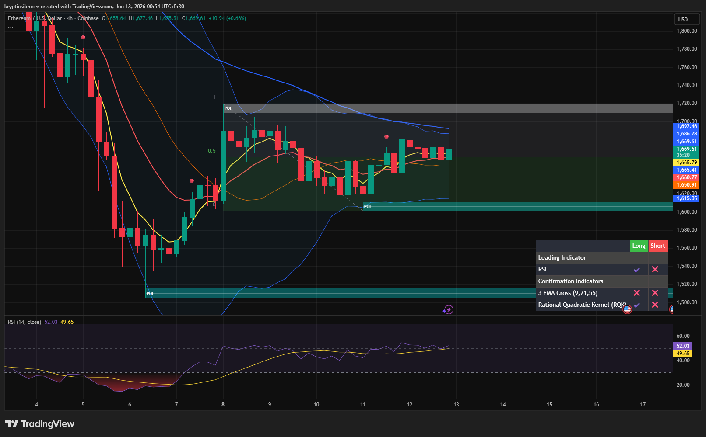

# Ethereum — 4H Consolidation Beneath Supply Resistance

**Date:** 2026-06-13
**Time:** ~00:54 IST
**Instrument:** ETHUSD
**Timeframe:** 4H
**Venue:** Coinbase
**Charting Platform:** TradingView

---

## Context

Ethereum has recovered significantly from the capitulation low established earlier in the month and is now trading within a well-defined consolidation range.

After the initial impulsive rebound, price has transitioned into sideways movement beneath a major supply zone, suggesting a temporary balance between buyers defending support and sellers protecting overhead resistance.

---

## Observation

### 1️⃣ Supply Zone Capping Price

* Multiple attempts to advance higher have stalled beneath the marked supply region.
* Price continues respecting the upper boundary of the range.
* No candle has achieved meaningful acceptance above resistance.

Supply remains the primary obstacle to further upside expansion.

### 2️⃣ Range-Bound Structure

* Ethereum has spent several sessions oscillating between local support and resistance.
* Higher lows have been maintained despite repeated pullbacks.
* Volatility has contracted compared to the earlier recovery phase.

The market appears to be building liquidity inside a compression structure.

### 3️⃣ EMA Compression

* Price is trading around the short-term EMA cluster.
* Fast EMAs have flattened as momentum slows.
* Neither buyers nor sellers have established clear dominance.

This reflects a neutral short-term environment.

### 4️⃣ RSI Stabilization

* RSI has stabilized near the 50 level.
* Momentum is neither overbought nor oversold.
* Recent readings indicate equilibrium rather than trend acceleration.

The momentum profile supports the ongoing consolidation thesis.

### 5️⃣ Demand Zone Holding

* The lower support region continues to attract buying interest.
* Recent pullbacks have failed to break support.
* Buyers remain active whenever price approaches the lower boundary of the range.

The recovery structure remains intact while support holds.

---

## Hypothesis

Ethereum is currently compressing beneath higher-timeframe supply while maintaining support above demand.

Two conditional paths remain active:

### Scenario A — Bullish Breakout

Acceptance above the supply zone would signal absorption of seller liquidity and could trigger continuation toward higher resistance levels and liquidity overhead.

### Scenario B — Range Rejection

Failure to reclaim supply may result in another rotation toward support, extending the current consolidation phase or potentially testing demand once again.

Until either boundary is broken decisively, the market remains range-bound.

---

## Invalidation / Confirmation

* Break and acceptance above supply → bullish continuation confirmed.
* Loss of local support and demand → bearish rotation confirmed.
* Continued higher lows within the range → consolidation remains valid.

---

## Notes

This setup reflects a classic post-recovery consolidation beneath a significant supply zone. Ethereum has successfully stabilized after the capitulation event, but buyers have yet to demonstrate enough strength to overcome overhead resistance. The longer this compression persists, the more important the eventual breakout direction becomes.

Text formatting and clarity were assisted by AI; the market analysis and structural interpretation are independently conducted by the author.
This material is intended for educational and research documentation purposes only and does not constitute financial advice.
