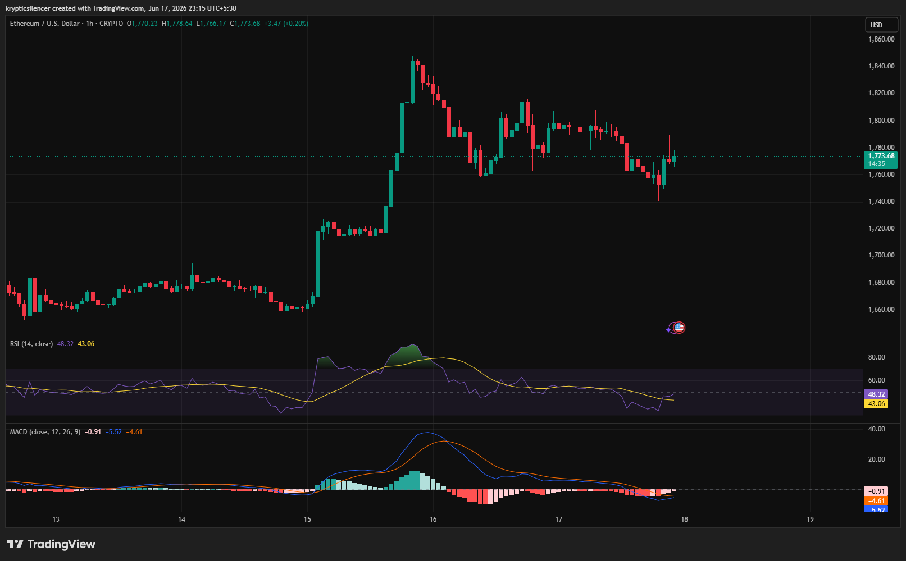

# Ethereum — 1H Post-Impulse Consolidation After Volatility Expansion

**Date:** 2026-06-17
**Time:** ~23:15 IST
**Instrument:** ETHUSD
**Timeframe:** 1H
**Venue:** Crypto Market
**Charting Platform:** TradingView

---

## Context

Ethereum experienced a sharp bullish expansion after several days of range-bound trading, breaking out aggressively and rallying toward the 1840–1850 region.

Following the impulsive move, price entered a consolidation phase as buyers and sellers reassessed value near higher prices. Volatility has contracted compared to the initial breakout leg.

---

## Observation

### 1️⃣ Impulsive Breakout

* ETH transitioned from low-volatility accumulation into a strong upward expansion.
* Multiple bullish candles created rapid price appreciation.
* Momentum accelerated quickly into local highs near 1850.

The initial breakout confirmed strong short-term buyer participation.

### 2️⃣ Profit-Taking Phase

* After reaching local highs, price retraced a portion of the advance.
* Selling pressure emerged near resistance, preventing immediate continuation.
* The correction has remained orderly rather than impulsively bearish.

Current weakness appears corrective rather than a complete trend reversal.

### 3️⃣ Range Formation

* Recent candles show repeated reactions between support and resistance.
* Price is consolidating around the mid-range near 1770–1800.
* Neither buyers nor sellers currently hold decisive control.

This behavior suggests market participants are waiting for the next catalyst.

### 4️⃣ RSI Behavior

* RSI surged into elevated territory during the breakout.
* Momentum has since normalized toward neutral levels.
* Current readings indicate neither overbought nor oversold conditions.

Momentum has cooled but remains structurally healthy.

### 5️⃣ MACD Compression

* MACD bullish momentum peaked during the expansion phase.
* Histogram readings contracted significantly afterward.
* Recent action suggests momentum equilibrium rather than trend acceleration.

The market is digesting the prior impulse move.

---

## Hypothesis

Ethereum is consolidating after a significant volatility expansion and remains within a post-breakout balancing phase.

Two conditional paths remain active:

### Scenario A — Bullish Continuation

A breakout above recent consolidation highs would signal renewed buyer participation and continuation of the prior impulsive trend.

### Scenario B — Deeper Retracement

Failure to hold consolidation support could trigger a larger corrective move toward lower demand zones before trend continuation becomes possible.

For now, price appears to be building a new equilibrium after the recent breakout.

---

## Invalidation / Confirmation

* Break above consolidation resistance → bullish continuation confirmed.
* Higher low formation within the range → buyers maintain control.
* Breakdown below consolidation support → deeper correction likely.

---

## Notes

This setup highlights a classic impulse-consolidation structure. The explosive rally created strong bullish momentum, while the subsequent sideways movement reflects profit-taking and market rebalancing. Traders should focus on the eventual breakout direction, as prolonged consolidation often precedes the next significant move.

Text formatting and clarity were assisted by AI; the market analysis and structural interpretation are independently conducted by the author.
This material is intended for educational and research documentation purposes only and does not constitute financial advice.
