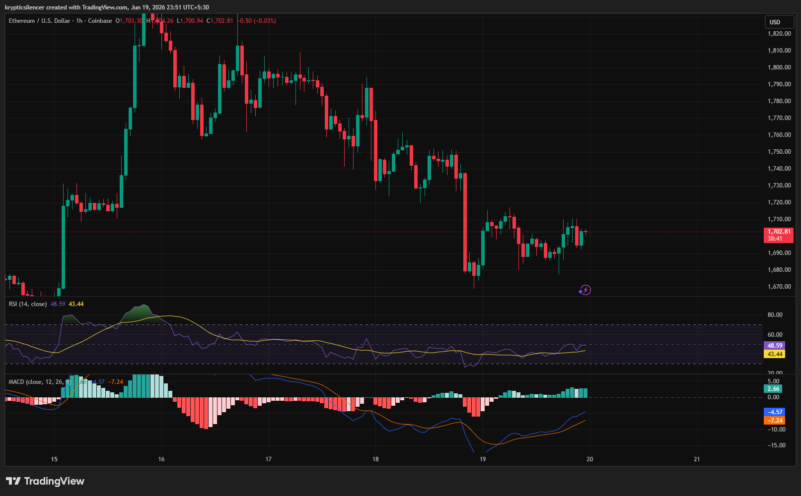

# Ethereum — 1H Bearish Structure Showing Signs of Momentum Stabilization

**Date:** 2026-06-19
**Time:** ~23:51 IST
**Instrument:** ETHUSD
**Timeframe:** 1H
**Venue:** Coinbase
**Charting Platform:** TradingView

---

## Context

Ethereum remains under short-term bearish pressure after failing to sustain the strong rally that pushed price above 1800 earlier in the week.

Following multiple lower highs and successive selloffs, ETH experienced a sharp breakdown into the 1670–1680 region before finding temporary support and attempting to stabilize.

---

## Observation

### 1️⃣ Bearish Market Structure

* Price continues to print lower highs and lower lows.
* Multiple recovery attempts have been rejected before reclaiming prior swing highs.
* Sellers remain in control of the broader short-term trend.

The dominant structure remains bearish despite recent stabilization.

### 2️⃣ Sharp Liquidation Event

* ETH experienced a strong impulsive selloff that quickly erased prior gains.
* The breakdown accelerated toward local demand, triggering a rapid decline.
* Price found support after the liquidation move and began consolidating.

The market appears to be digesting the recent volatility shock.

### 3️⃣ Range-Bound Recovery

* Recent candles show sideways movement between support and resistance.
* Buyers have managed to defend the lows, preventing immediate continuation downward.
* However, bullish momentum remains limited.

Current price action reflects consolidation rather than trend reversal.

### 4️⃣ RSI Recovery

* RSI rebounded from lower levels and is approaching the neutral zone.
* Momentum has improved compared to the recent lows.
* The indicator remains below levels typically associated with strong bullish trends.

Momentum is recovering but not yet dominant.

### 5️⃣ MACD Improvement

* MACD histogram has transitioned back into positive territory.
* The MACD line is attempting to separate above the signal line.
* Bearish momentum continues to weaken.

Momentum indicators suggest selling pressure is slowing.

---

## Hypothesis

Ethereum is attempting to establish a base after a significant downside move.

Two conditional paths remain active:

### Scenario A — Recovery Continuation

A break above recent consolidation highs would confirm strengthening buyer participation and could initiate a larger retracement toward overhead resistance zones.

### Scenario B — Bearish Continuation

Failure to reclaim resistance followed by a loss of current support would reassert bearish control and increase the probability of new local lows.

For now, ETH appears to be transitioning from impulsive decline into consolidation.

---

## Invalidation / Confirmation

* Break above recent range highs → recovery thesis strengthens.
* Higher low formation → stabilization confirmed.
* Breakdown below recent support → bearish continuation confirmed.

---

## Notes

This setup highlights a market transitioning from a strong bearish impulse into a potential accumulation or stabilization phase. While price structure remains bearish overall, RSI recovery and improving MACD readings indicate that downside momentum is fading. The next breakout from the current range will likely determine short-term direction.

Text formatting and clarity were assisted by AI; the market analysis and structural interpretation are independently conducted by the author.
This material is intended for educational and research documentation purposes only and does not constitute financial advice.
