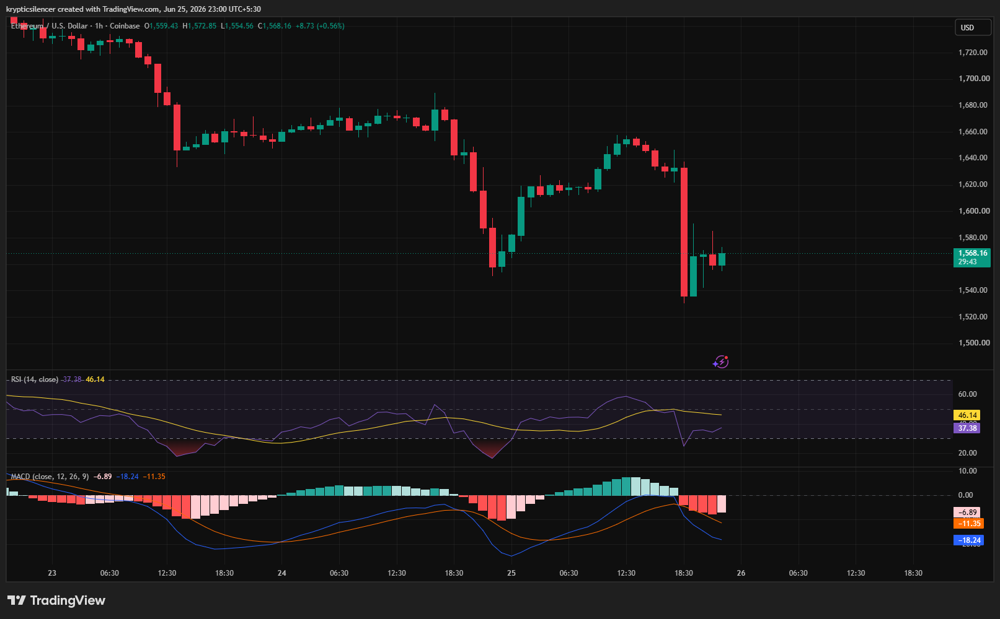

# ETH/USD — 1H Sharp Selloff Tests Buyer Conviction Near Intraday Support

**Date:** 2026-06-25
**Time:** ~23:00 IST
**Instrument:** ETHUSD
**Timeframe:** 1H
**Venue:** Coinbase
**Charting Platform:** TradingView

---

## Context

Ethereum has remained under short-term bearish pressure after failing to sustain multiple recovery attempts over the past several sessions. Although buyers managed to generate temporary rebounds, each rally was eventually met with renewed selling.

The latest decline has pushed price back toward an important intraday support region following a sharp impulsive selloff.

---

## Observation

### 1️⃣ Sharp Bearish Impulse

* ETH experienced a large bearish candle that erased the previous intraday advance.
* Selling pressure accelerated quickly with little buying support during the decline.
* The move reinforces the current short-term bearish sentiment.

The recent impulse highlights aggressive seller participation.

### 2️⃣ Weak Recovery Attempt

* Buyers responded immediately after the selloff.
* However, the rebound has remained relatively shallow.
* Price is consolidating near support instead of reclaiming previous highs.

Recovery momentum remains limited.

### 3️⃣ RSI Recovers From Oversold Levels

* RSI briefly entered oversold territory during the selloff.
* Momentum has improved slightly following the bounce.
* Current readings remain below strong bullish momentum levels.

The recovery in RSI suggests reduced selling pressure but not a confirmed trend reversal.

### 4️⃣ MACD Remains Bearish

* MACD remains below the signal line.
* Histogram continues to print negative values.
* Although downside momentum is easing, bears retain short-term control.

Momentum indicators continue to favor sellers.

### 5️⃣ Support Zone Under Observation

* Price is attempting to stabilize after reacting from intraday support.
* Buyers have defended the immediate lows for now.
* Confirmation is still required before a meaningful recovery can be established.

The current support area will likely determine the next directional move.

---

## Hypothesis

Ethereum remains vulnerable after another strong rejection despite showing signs of short-term stabilization.

Two conditional paths remain active:

### Scenario A — Relief Recovery

A successful defense of current support combined with improving momentum could allow ETH to recover toward recent intraday resistance levels.

### Scenario B — Bearish Continuation

Failure to hold the current support region would reinforce the existing bearish structure and increase the probability of another downside leg.

Current structure favors caution until buyers reclaim nearby resistance.

---

## Invalidation / Confirmation

* Break above the most recent swing high → bearish structure weakens.
* RSI continues recovering alongside a bullish MACD crossover → recovery gains credibility.
* Breakdown below current support → bearish continuation confirmed.

---

## Notes

This setup reflects a market attempting to stabilize after an aggressive intraday selloff. While buyers have defended the immediate support area, the recovery remains limited and momentum indicators continue to favor sellers. The next reaction around current support will be important in determining whether ETH enters a relief bounce or resumes its broader short-term downtrend.

Text formatting and clarity were assisted by AI; the market analysis and structural interpretation are independently conducted by the author. This material is intended for educational and research documentation purposes only and does not constitute financial advice.
