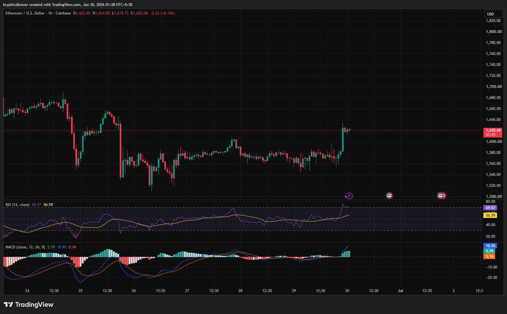

# ETH — 1H Bullish Breakout Strengthens Short-Term Momentum

**Date:** 2026-06-30  
**Time:** ~01:38 IST  
**Instrument:** ETHUSD  
**Timeframe:** 1H  
**Venue:** Coinbase  
**Charting Platform:** TradingView  

---

## Context

Ethereum spent the past several sessions consolidating within a relatively tight range after recovering from earlier volatility. Price action remained largely sideways as buyers and sellers reached temporary equilibrium.

The latest impulsive move has broken price above the recent consolidation, shifting short-term momentum back in favor of buyers.

---

## Observation

### 1️⃣ Strong Breakout Candle

* Price produced a large bullish impulse from the consolidation range.
* The breakout occurred with strong momentum and minimal immediate rejection.
* Buyers successfully reclaimed higher price levels.

This suggests renewed buying interest entering the market.

### 2️⃣ Range Resistance Broken

* ETH has pushed above the upper boundary of its recent trading range.
* Previous resistance is now the first level to monitor for potential support.
* Sustaining this breakout would strengthen the short-term bullish structure.

Holding above the breakout level is now critical.

### 3️⃣ RSI Approaching Overbought

* RSI has surged toward the 70 level.
* Momentum has expanded significantly following the breakout.
* While bullish, elevated RSI may lead to short-term cooling if buyers lose momentum.

Momentum currently favors the bulls.

### 4️⃣ MACD Confirms Bullish Momentum

* MACD has crossed above the signal line.
* Histogram has expanded into positive territory.
* Momentum continues to strengthen following the breakout.

MACD supports the current bullish move.

### 5️⃣ Buyers Regain Short-Term Control

* Recent higher lows remain intact.
* The breakout shifts immediate market structure in favor of buyers.
* Continuation depends on whether price can defend the breakout zone.

The market now transitions from consolidation into a potential expansion phase.

---

## Hypothesis

Ethereum has broken above short-term consolidation with improving momentum across multiple indicators.

Two conditional paths remain active:

### Scenario A — Bullish Continuation

If buyers defend the breakout level and momentum remains elevated, ETH could continue extending toward higher resistance levels.

### Scenario B — Breakout Failure

Failure to hold above the breakout zone could result in a pullback back into the previous range, delaying bullish continuation.

The current structure favors buyers while the breakout remains intact.

---

## Invalidation / Confirmation

* Hold above recent breakout level → bullish continuation strengthens.
* RSI maintaining strength with positive MACD expansion → momentum remains supportive.
* Breakdown back below the previous consolidation range → breakout loses credibility.

---

## Notes

Ethereum has shifted from consolidation into a short-term bullish breakout supported by strengthening RSI and a positive MACD crossover. The key area to monitor is the former resistance zone, which may now serve as support. As long as buyers defend this level, the short-term outlook remains constructive.

Text formatting and clarity were assisted by AI; the market analysis and structural interpretation are independently conducted by the author. This material is intended for educational and research documentation purposes only and does not constitute financial advice.
