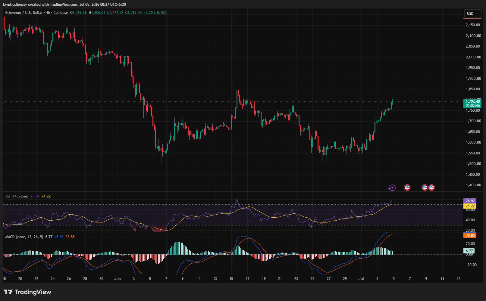

# ETH — 4H Strong Recovery Pushes Ethereum Toward Overbought Territory

**Date:** 2026-07-05  
**Time:** ~00:27 IST  
**Instrument:** ETHUSD  
**Timeframe:** 4H  
**Venue:** Coinbase  
**Charting Platform:** TradingView  

---

## Context

Ethereum has staged a strong recovery after spending several sessions consolidating near recent lows. Following a sustained advance from the mid-1500 region, price has reclaimed multiple resistance levels and is now approaching the upper end of its recent trading range.

Momentum has shifted decisively in favor of buyers.

---

## Observation

### 1️⃣ Strong Bullish Recovery

* ETH has produced a sequence of higher highs and higher lows.
* Buyers have maintained control throughout the recent advance.
* Price has recovered a significant portion of the previous decline.

The short-term trend has turned bullish.

### 2️⃣ Break Above Consolidation

* Price has successfully broken out of its recent consolidation zone.
* Previous resistance has been reclaimed with strong momentum.
* Buyers continue to defend higher prices after the breakout.

Market structure favors continuation while the breakout holds.

### 3️⃣ RSI Enters Overbought Territory

* RSI has climbed above the 70 level.
* Momentum remains exceptionally strong.
* Elevated RSI reflects aggressive buying but may also increase the probability of short-term consolidation.

Momentum currently favors buyers despite overextended conditions.

### 4️⃣ MACD Confirms Bullish Expansion

* MACD remains above the signal line.
* Positive histogram bars continue expanding.
* Bullish momentum remains firmly intact.

Momentum indicators support the ongoing uptrend.

### 5️⃣ Resistance Approaches

* Price is approaching an area where previous selling pressure emerged.
* The next reaction at resistance will help determine whether buyers can extend the rally.
* Holding above recent breakout levels remains critical.

The market is transitioning from recovery into resistance testing.

---

## Hypothesis

Ethereum has established a strong bullish recovery supported by improving market structure and strengthening momentum indicators.

Two conditional paths remain active:

### Scenario A — Bullish Continuation

A successful break above nearby resistance with sustained momentum could extend the current rally toward higher price levels.

### Scenario B — Healthy Pullback

Failure to overcome resistance may trigger a short-term retracement toward the recent breakout zone before buyers attempt another advance.

The current structure continues to favor buyers while higher lows remain intact.

---

## Invalidation / Confirmation

* Break above nearby resistance → bullish continuation strengthens.
* RSI remaining elevated alongside positive MACD expansion → momentum stays supportive.
* Breakdown below the recent breakout level → recovery weakens and consolidation becomes more likely.

---

## Notes

Ethereum has transitioned from consolidation into a strong bullish recovery, supported by higher highs, higher lows, and strengthening momentum across both RSI and MACD. While RSI has entered overbought territory, the broader structure remains constructive as long as buyers continue defending recent breakout levels.

Text formatting and clarity were assisted by AI; the market analysis and structural interpretation are independently conducted by the author. This material is intended for educational and research documentation purposes only and does not constitute financial advice.
