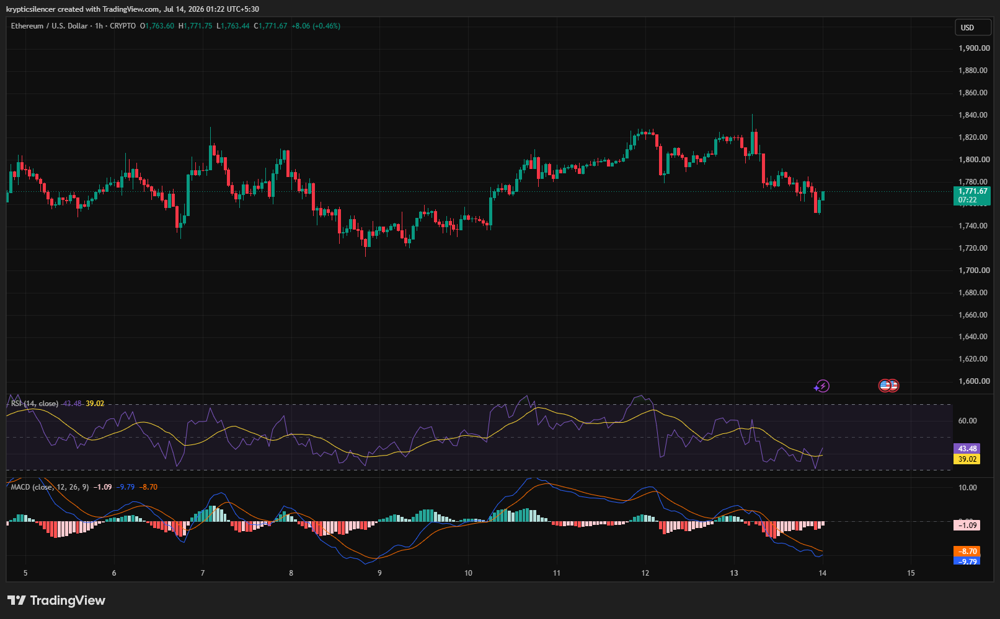

# Ethereum — 1H Pullback Tests Buyer Commitment Near Support

**Date:** 2026-07-14  
**Time:** ~01:22 IST  
**Instrument:** ETHUSD  
**Timeframe:** 1H  
**Venue:** Crypto  
**Charting Platform:** TradingView  

---

## Context

Ethereum has entered a short-term pullback after rallying toward the 1,820 region. Following several days of higher prices, sellers regained control, pushing ETH back toward the 1,770 area where buyers are attempting to stabilize the market.

The current reaction will determine whether this is simply a corrective pullback or the beginning of a deeper decline.

---

## Observation

### 1️⃣ Short-Term Downtrend Develops

* Price has formed a sequence of lower highs and lower lows.
* Selling pressure increased after rejection from recent highs.
* The latest candles show buyers attempting a modest rebound.

Short-term momentum currently favors sellers.

### 2️⃣ Support Zone Under Test

* ETH is trading near a recent reaction area around 1,770.
* Buyers have responded with small recovery candles.
* A sustained defense is needed to prevent further downside.

Support remains the key level to monitor.

### 3️⃣ RSI Near Bearish Territory

* RSI has fallen into the low-40 region.
* Momentum remains below the neutral 50 level.
* The recent bounce has not yet produced a meaningful momentum shift.

Momentum still leans bearish.

### 4️⃣ MACD Remains Negative

* MACD remains below the signal line.
* Histogram continues printing negative values.
* Downside momentum is beginning to stabilize but has not reversed.

Momentum indicators continue to favor sellers.

### 5️⃣ Buyers Attempt Stabilization

* Recent candles show reduced selling pressure.
* Price is attempting to hold above local support.
* Confirmation requires stronger bullish follow-through.

The current bounce remains tentative.

---

## Hypothesis

Ethereum is undergoing a corrective pullback while testing an important support region.

Two conditional paths remain active:

### Scenario A — Recovery

A successful defense of current support combined with improving momentum could allow ETH to retest recent swing highs.

### Scenario B — Bearish Continuation

Failure to hold support would reinforce the developing lower-high structure and increase the probability of further downside.

Current structure remains cautiously bearish until buyers reclaim recent resistance.

---

## Invalidation / Confirmation

* Break above the latest lower high → bearish structure weakens.
* RSI recovers above 50 with bullish MACD crossover → recovery gains credibility.
* Breakdown below current support → bearish continuation strengthens.

---

## Notes

Ethereum is testing a key support zone after losing short-term momentum. RSI remains below neutral while MACD continues to favor sellers, suggesting the recent bounce is not yet confirmed. Buyers must defend current levels and reclaim nearby resistance to shift the short-term outlook back in their favor.

Text formatting and clarity were assisted by AI; the market analysis and structural interpretation are independently conducted by the author. This material is intended for educational and research documentation purposes only and does not constitute financial advice.
