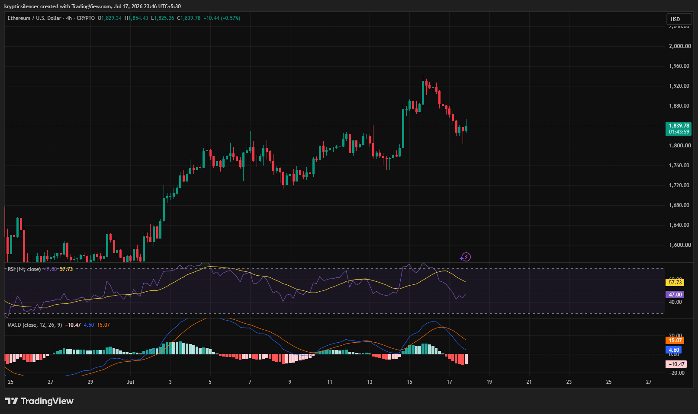

 # Ethereum — 4H Rally Cools After Sharp Breakout as Momentum Pulls Back

**Date:** 2026-07-17  
**Time:** ~23:46 IST  
**Instrument:** ETHUSD  
**Timeframe:** 4H  
**Venue:** CRYPTO  
**Charting Platform:** TradingView  

---

## Context

Ethereum extended its broader recovery with a strong impulsive rally that carried price toward the 1,940 region before encountering selling pressure. Following the breakout, profit-taking emerged, leading to a controlled pullback rather than a sharp reversal.

Price is now attempting to stabilize above the recent breakout zone.

---

## Observation

### 1️⃣ Pullback Follows Strong Rally

* ETH produced a sharp bullish expansion before reversing from local highs.
* The decline has been orderly, lacking panic selling.
* Price remains well above the previous consolidation area.

The broader uptrend remains intact despite the recent correction.

### 2️⃣ Higher Low Structure Holds

* The recent pullback has not broken the previous swing lows.
* Market structure continues to favor higher lows.
* Buyers are attempting to defend the current region.

The trend remains constructive unless support fails.

### 3️⃣ RSI Returns to Neutral

* RSI has cooled into the mid-range after reaching elevated levels.
* Momentum has eased without becoming oversold.
* This reset leaves room for another directional move.

Momentum has normalized following the rally.

### 4️⃣ MACD Shows Momentum Cooling

* MACD has crossed below the signal line.
* Histogram has turned negative, reflecting weakening bullish momentum.
* The correction appears momentum-driven rather than structurally bearish.

Indicators suggest consolidation instead of a confirmed trend reversal.

### 5️⃣ Support Becomes Key

* Price is testing the breakout area after the pullback.
* Holding this region would reinforce the bullish structure.
* A decisive loss of support would increase the probability of a deeper correction.

Current support will likely determine the next major move.

---

## Hypothesis

Ethereum remains in a broader bullish structure despite short-term momentum cooling.

Two conditional paths remain active:

### Scenario A — Bullish Continuation

If buyers defend the current support zone and momentum begins improving again, ETH could resume its advance toward recent highs.

### Scenario B — Deeper Pullback

Failure to hold support alongside continued MACD weakness would increase the likelihood of an extended correction before buyers regain control.

The overall structure still favors buyers while higher lows remain intact.

---

## Invalidation / Confirmation

* Hold above the recent breakout support → bullish trend remains intact.
* RSI recovering toward higher levels with a bullish MACD crossover → continuation gains credibility.
* Breakdown below the recent higher low → probability of a deeper correction increases.

---

## Notes

Ethereum is undergoing a healthy pullback following a strong breakout. While RSI has cooled and MACD reflects weakening momentum, the broader trend remains constructive as long as the recent higher-low structure is preserved.

Text formatting and clarity were assisted by AI; the market analysis and structural interpretation are independently conducted by the author. This material is intended for educational and research documentation purposes only and does not constitute financial advice.
