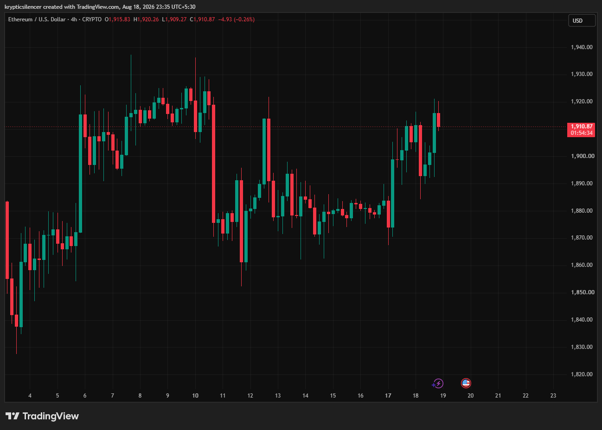

# ETH — 4H Resistance Test After Strong Recovery

**Date:** 2026-08-18
**Time:** ~23:35 IST
**Instrument:** ETHUSD
**Timeframe:** 4H
**Venue:** CRYPTO
**Charting Platform:** TradingView

---

## Context

Ethereum has recovered strongly from the $1,850–$1,870 region and is now approaching a major resistance area around $1,920–$1,935. Price action remains volatile, with repeated rejections around the upper end of the recent range.

---

## Observation

### 1️⃣ Recovery From Support

* ETH established support around $1,850–$1,870.
* Buyers pushed price steadily higher from the August 17 lows.
* Price has reclaimed the $1,900 level and is now trading near $1,911.

The short-term structure has shifted back toward the buyers.

### 2️⃣ Resistance Around $1,920–$1,935

* Several previous candles produced rejections around $1,920.
* The chart shows multiple attempts to trade above this region.
* A sustained breakout has not yet occurred.

This remains the key decision zone.

### 3️⃣ Range Structure

* ETH has spent much of the period between roughly $1,870 and $1,925.
* The recent recovery is bringing price back toward the top of that range.
* A breakout would provide a clearer directional signal than the current consolidation.

### 4️⃣ Volatility Remains Elevated

* Large candles and long wicks are frequent throughout the structure.
* Breakouts and breakdowns have repeatedly failed to sustain.
* Confirmation is therefore more important than simply trading an intraday wick.

---

## Hypothesis

ETH is approaching a critical resistance test after recovering from the lower end of its recent range.

### Scenario A — Bullish Breakout

A sustained 4H close above the $1,920–$1,935 resistance region could confirm a range breakout and open the possibility of continuation toward higher levels.

### Scenario B — Rejection

Failure to break resistance could send ETH back toward $1,900 and potentially the $1,870–$1,880 support region.

---

## Invalidation / Confirmation

* 4H close above $1,920–$1,935 → bullish breakout gains confirmation.
* Rejection followed by a loss of $1,900 → short-term momentum weakens.
* Breakdown below $1,870–$1,880 → broader recovery structure becomes questionable.

---

## Notes

ETH has recovered strongly from the lower end of its recent range, but the market is now approaching a significant resistance zone. The reaction around $1,920–$1,935 should provide the clearest signal for the next directional move. Until a confirmed breakout or breakdown occurs, range-bound conditions remain the higher-confidence interpretation.

Text formatting and clarity were assisted by AI; the market analysis and structural interpretation are independently conducted by the author. This material is intended for educational and research documentation purposes only and does not constitute financial advice.
