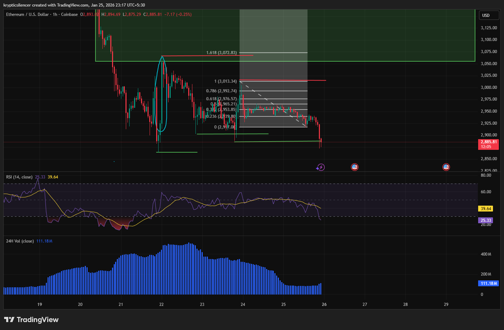

# Ethereum 1-Hour Oversold and Potential Mean-Reversion Setup

**Date:** 2026-01-25  
**Time:** 23:17 IST  
**Instrument:** ETH / USD  
**Timeframe:** 1-hour  
**Venue:** Coinbase  
**Charting Platform:** TradingView  

---

## Context
Ethereum extended lower on the 1-hour timeframe following a sustained
downtrend and repeated rejection near descending structure.

## Observation
Price has moved into a local extension zone of the downward type, which is defined by Fibonacci projection and trendline support.
The Relative Strength Index (RSI) is currently in the oversold region, and volume expansion can be observed.

There is less downside follow-through close to the support level in recent candlesticks.

## Hypothesis
If selling pressure weakens, price may attempt a short-term mean-reversion
move from current oversold conditions.

This hypothesis is contingent on stabilization near support and the
absence of further impulsive continuation.

## Notes
Logged for research and pattern-recognition purposes only.
No trade recommendation or financial advice is expressed.
